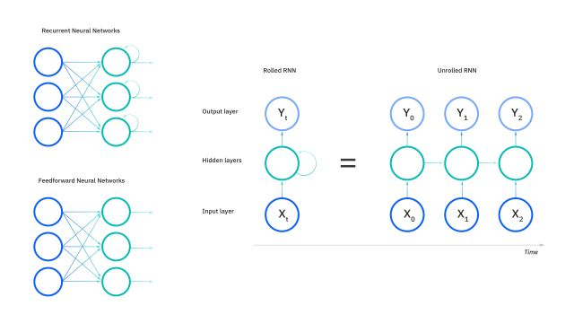
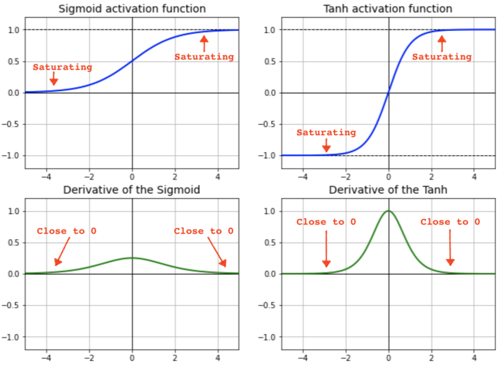

# RNN에 관한 정리?

RNN(Recurrent Neural Network)은 신경망의 한 종류로, 1980년대 초반부터 연구되어 왔다.

초기에는 Elman 신경망이나 Jordan 신경망 등으로 불렸으며, 초반에는 이론적으로 연구만 진행되었지 실제 사용에 활발한 모습은 아니었다. 그러나 1990년대 이후 시퀸스 데이터 (시계열 데이터, 문장, 음성 신호, 암호 해독 등) 처리의 중요성이 부각되면서 불이 붙게 되었다.

기존에 간간히 사용되던 시퀸스 데이터를 위한 신경망 구조들은 고정된 길이의 입력만 처리할 수 있었다. 이는 Real World에선 굉장히 한계가 많은 구조였지만, 길이에 영향을 받지 않는 RNN이 등장하면서 판도가 바뀌게 되었다.

추후 RNN의 단점을 보완하기 위해 나온 그 유명한 LSTM(Long Short-Term Memory)과 GRU(Gated Recurrent Unit)이 세상에 나오게 되었다. (LSTM에 추가 토핑을한 더 성능좋고 멋있는 모델,CNN-LSTM, 과같은 이 진짜 많다.)

# RNN의 원리

RNN은 순차적인 데이터, 즉 시계열 데이터를 처리하기 위한 신경망으로, 이전 시간 단계의 정보를 현재 시간 단계로 전달하여 순서 정보를 학습하고 활용하는 특징을 가지고 있다.

RNN은 각 시간 단계마다 입력 벡터와 이전 시간 단계의 은닉 상태(hidden state)를 입력으로 받고, 은닉 상태는 현재까지의 입력 정보를 요약하고 이를 바탕으로 다음 단계의 은닉 상태를 생성.

이러한 과정을 시퀀스의 각 단계마다 반복하면, 전체 시퀀스에 대한 은닉 상태 표현을 얻을 수 있다.

아래는 RNN만 검색해도 수도없이 마주치는 RNN연산 과정 flowchat다.

_출처 : IBM_

RNN은 입력 벡터와 은닉 상태를 각각 가중치와 Activation Function으로 연결. 일반적으로는 은닉 상태를

계산하는데에는 tanh 함수를 사용한다.

RNN은 기본적으로 재귀연산이다. tanh함수가 아닌 relu와 같은 선형함수를 사용하면 반복되는 가중치 연산에 단순 곱연산으로 가중치가 계속해서 발산 하는 형태가 되기 때문이다.

때문에 Normalizing이 가능한 Sigmoid나 tanh를 사용한다.

조금 더 깊게 들어가 보면, RNN이 기본적으로 Activation Function으로 tanh를 선호하는 이유는 sigmoid보다 기울기 소실에 덜 민감하기 때문이다. 하지만 tanh또한 반복 횟수가 많아지면 역시....

그 외에도 RNN이 Linear Function이 아닌 tanh과 같은 non-Linear Function을 쓰는이유는 또 다른 이유는,

1. Non-Linearity : 비선형 함수의 특성으로, 재귀 연산의 복잡성과 -1과 1사이 계속적인 Normalization때문에 효과적으로 Layer를 구성, 계산할 수 있다.

2. Grandiant Flow : tanh함수는 0에 가까울 수록 미분값이 커지기 때문에, 역전파(backpropagation)과정중 기울기 전달에 더 효과적이다.

3. 뭔가가 더있었는데.. 찾아보고 업데이트 해야겠다.

이렇게 계산된 은닉 상태는 다음 시간 단계로 전달되어 입력과 함께 새로운 은닉 상태를 생성한다.

# RNN의 장점-단점

## 장점

- RNN은 순차적인 데이터(문장, 시계열 등)를 처리하기에 효과적.
- 입력과 출력 시퀀스의 길이에 제한이 없고, 가변 길이의 데이터 처리가 가능.

## 단점

- 장기 의존성 문제. 길이가 긴 시퀸스 데이터의 경우 초기 입력 정보가 점차 희석되어 그 영향력이 감소하면서 생기는 문제.
- 기울기의 불안정성. RNN을 오랜기간 학습하고 정보를 업데이트 하면서 기울기가 지수적으로 증가하거나 감소하여 더이상의 학습이 진행되지 않음.
- 병렬 처리가 어려움. (좀 치명적임)
- 동일한 연산을 반복하면서 기존데이터를 계속 기억해야 하기 때문에 많은 계산량과 소요 자원이 필요.
