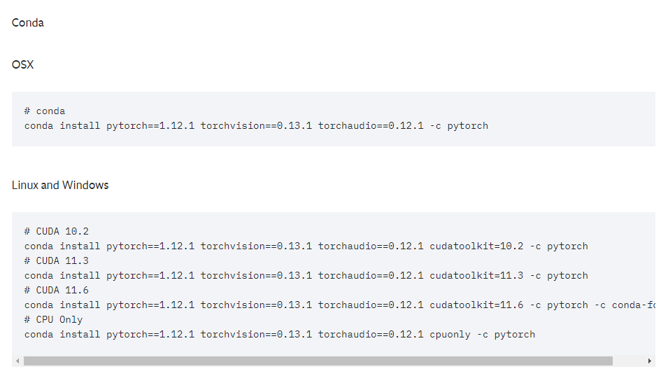
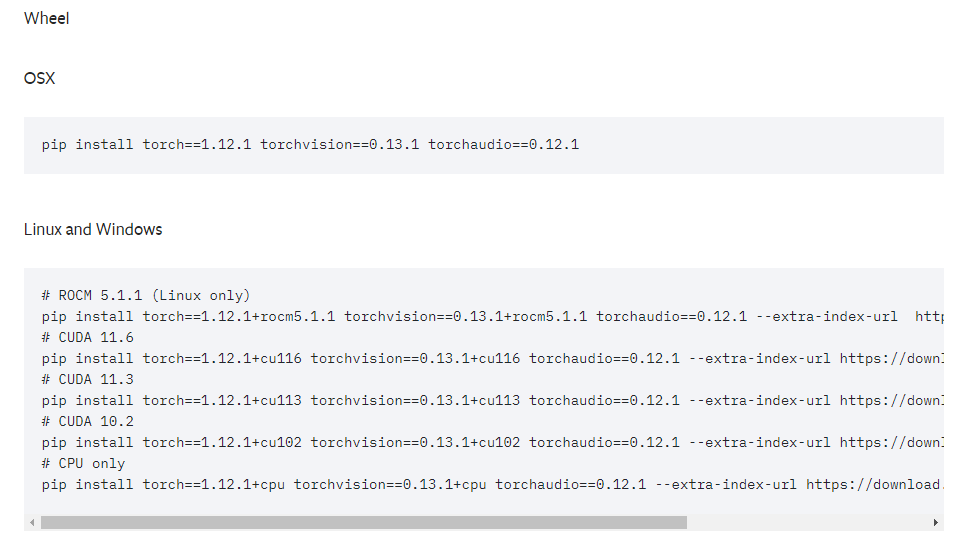

# Torch에서 CUDA 사용 실패하는 경우

진행하던 프로젝트를 시험 서버에서 가동하기위해 세팅중 예전에 봐뒀다가 해결 후 정리 안해둔 머리아픈 에러를 마주했다.

```latex
RuntimeError: CUDA error: no kernel image is available for execution on the device
```

이상했다.. python 버전도, torch도 모두 사용하던거와 동일한 requirements로 설치했는데…

생각해보니 CUDA와 관련된 셋팅이 아무것도 되어있지 않았다.

위 에러가 뜨는 이유는 대충 아래와 같다.

1. CUDA Toolkit이 설치가 안되어있는 경우.
2. 설치된 CUDA Toolkit의 version을 torch가 호환을 안하는 경우.
3. CUDA version, ($ nvidia -smi) 와 (nvcc -V or nvcc —version)의 버전이 다를경우
   1. nvidia-smi로 확인하는 CUDA version은 현재 설치되어있는 nividia-driver에서 호환되는 latest version을 표현한다. → 현재상황에서 설치가능한 가장 높은 버전 수
   2. nvcc -V는 실제 설치되어있는 CUDA버전이다.

※ 만약 nvcc 가 없다고 나올경우 ‘sudo apt install nvidia-cuda-toolkit’ 으로 설치하자.

현재 환경에서 nvidia-smi 와 nvcc -V로 확인한 버전은 아래와 같다.

```latex
$ nvidia-smi
Mon Jun 19 15:53:12 2023
+-----------------------------------------------------------------------------+
| NVIDIA-SMI 515.65.01    Driver Version: 516.94       CUDA Version: 11.7     |
|-------------------------------+----------------------+----------------------+
| GPU  Name        Persistence-M| Bus-Id        Disp.A | Volatile Uncorr. ECC |
| Fan  Temp  Perf  Pwr:Usage/Cap|         Memory-Usage | GPU-Util  Compute M. |
|                               |                      |               MIG M. |
|===============================+======================+======================|
|   0  NVIDIA GeForce ...  On   | 00000000:01:00.0  On |                  N/A |
| 53%   36C    P8    11W / 120W |   1121MiB /  3072MiB |      2%      Default |
|                               |                      |                  N/A |
+-------------------------------+----------------------+----------------------+

+-----------------------------------------------------------------------------+
| Processes:                                                                  |
|  GPU   GI   CI        PID   Type   Process name                  GPU Memory |
|        ID   ID                                                   Usage      |
|=============================================================================|
|  No running processes found                                                 |
+-----------------------------------------------------------------------------+

###############################################################################

$ nvcc -V
nvcc: NVIDIA (R) Cuda compiler driver
Copyright (c) 2005-2022 NVIDIA Corporation
Built on Tue_Mar__8_18:18:20_PST_2022
Cuda compilation tools, release 11.6, V11.6.124
Build cuda_11.6.r11.6/compiler.31057947_0
```

CUDA의 버전은 11.7, Cuda compiler의 버전은 11.6으로 나왔다.

해서 현재 환경의 버전을 삭제 및 재설치 해 많은 dependency를 꼬이게 하지 않고 새로운 환경을 만들어서 진행했다.

```bash
conda create --name work_torch python=3.9.7
conda activate work_torch
conda install pytorch==1.12.1 torchvision==0.13.1 torchaudio==0.12.1 cudatoolkit=11.6 -c pytorch -c conda-forge
```

위 명령어를 진행할 때, 주의해야할 점들을 정리하면

1. cudatoolkit은 cuda compiler의 버전과 동일한 버전으로 설치해야한다.
2. CUDA의 버전에 호환하는 pytorch와 vision등의 버전이 따로있다.
   [[https://pytorch.org/get-started/previous-versions/](https://pytorch.org/get-started/previous-versions/)]

약 5~10분정도의 설치시간이 지나면 문제는 해결!

인줄 알았으나..

```latex
$python3
>>> import torch
>>> torch.cuda.is_available()
False
```

False라니… 분명 버전도 맞췄고, 호환되는 pytorch와 vision등을 설치했는데 cuda를 불러오지 못하고 있다.

또다시 1시간 가량 구글링을 해본 결과, 현재 설치되어있는 pytorch와 torchvision, torchaudio가 모두 cuda를 지원하지 않는 경우 일 수 있다고 한다.

```latex
Current Install : torch==1.12.1
What actually need : torch==1.12.1+cu116
```

그러다가 PyTorch 페이지에서 수상한 부분을 발견했다.

## Conda 라고 요약되어있는 설치 가이드 부분



## Wheel 로 요약되어있는 부분



Wheel로 되어있는 부분이 내가 원하는 cu116을 포함하는 install command를 안내하고있다.

혹시나 하는 마음에 설치되어있던 것을 지우고 conda install이 아닌 pip install을 이용해 설치했다.

```bash
conda uninstall pytorch torchvision torchaudio

# CUDA 11.6
pip install torch==1.12.1+cu116 torchvision==0.13.1+cu116 torchaudio==0.12.1 --extra-index-url https://download.pytorch.org/whl/cu116
```

그러고 다시…

```latex
$python3
>>> import torch
>>> torch.cuda.is_available()
True
```

진짜 해결!
