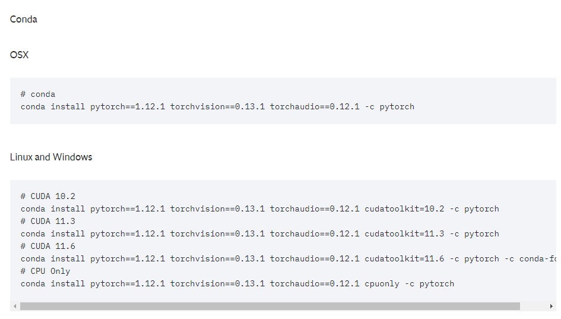
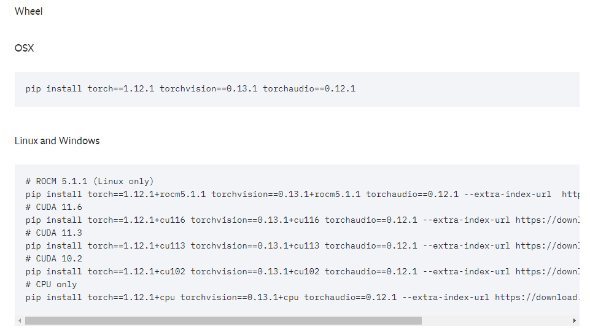

# torch.cuda.is_available() False 해결 (no kernel image 에러 포함)

> **Corrected October 2026:** The original list of causes was misleading. PyTorch's pip and conda builds ship their own CUDA runtime, so the system CUDA Toolkit (`nvcc`) version does not need to match. "No kernel image" means the installed PyTorch build was not compiled for your GPU's architecture. PyTorch also stopped publishing to the `-c pytorch` conda channel after 2.5. A diagnostic script, tested with PyTorch 2.14.1, was added at the end.
{:.note}

**먼저 결론부터 (2026년에 다시 정리)**

- `torch.cuda.is_available()`가 False면 제일 먼저 `torch.version.cuda`를 찍어본다. **`None`이면 CPU 전용 torch가 깔린 것**이다. 내 경우도 이거였다.
- `no kernel image is available` 에러는 **설치된 torch가 내 GPU 아키텍처(sm_xx)용으로 빌드되지 않았다**는 뜻이다. 너무 오래된 GPU나 너무 새 GPU에서 난다.
- pip이나 conda로 받은 torch는 CUDA 런타임을 자체로 들고 있다. **시스템에 깔린 nvcc 버전과 맞출 필요는 없다.** 드라이버만 충분히 새 버전이면 된다.
- 지금(2026-10 기준)은 conda `-c pytorch` 채널이 2.5에서 끊겼다. 공식 설치는 `pip install torch --index-url https://download.pytorch.org/whl/cu126` 같은 형태다.

진행하던 프로젝트를 시험 서버에서 가동하기위해 세팅중 예전에 봐뒀다가 해결 후 정리 안해둔 머리아픈 에러를 마주했다.

```latex
RuntimeError: CUDA error: no kernel image is available for execution on the device
```

이상했다.. python 버전도, torch도 모두 사용하던거와 동일한 requirements로 설치했는데…

생각해보니 CUDA와 관련된 셋팅이 아무것도 되어있지 않았다.

위 에러가 뜨는 이유는 대충 아래와 같다.

1. CUDA Toolkit이 설치가 안되어있는 경우.
2. 설치된 CUDA Toolkit의 version을 torch가 호환을 안하는 경우.
3. CUDA version, ($ nvidia -smi) 와 (nvcc -V or nvcc —version)의 버전이 다를경우
   1. nvidia-smi로 확인하는 CUDA version은 현재 설치되어있는 nividia-driver에서 호환되는 latest version을 표현한다. → 현재상황에서 설치가능한 가장 높은 버전 수
   2. nvcc -V는 실제 설치되어있는 CUDA버전이다.

※ 만약 nvcc 가 없다고 나올경우 ‘sudo apt install nvidia-cuda-toolkit’ 으로 설치하자.

> (2026 수정) 그때는 위 세 가지가 원인인 줄 알았는데, 다시 찾아보니 절반은 틀렸다. NVIDIA 문서 설명으로 이 에러(`cudaErrorNoKernelImageForDevice`)는 "그 장치에 맞는 커널 이미지가 없다", 즉 **프로그램이 내 GPU 아키텍처용으로 컴파일되지 않았다**는 뜻이다. CUDA Toolkit(nvcc)이 없거나 버전이 달라서 나는 에러가 아니다. torch만 쓸 거면 nvcc는 아예 없어도 된다. nvidia-smi에 나오는 CUDA 버전이 "드라이버가 지원하는 최대 버전"이라는 3-1번 설명은 맞다.

현재 환경에서 nvidia-smi 와 nvcc -V로 확인한 버전은 아래와 같다.

```latex
$ nvidia-smi
Mon Jun 19 15:53:12 2023
+-----------------------------------------------------------------------------+
| NVIDIA-SMI 515.65.01    Driver Version: 516.94       CUDA Version: 11.7     |
|-------------------------------+----------------------+----------------------+
| GPU  Name        Persistence-M| Bus-Id        Disp.A | Volatile Uncorr. ECC |
| Fan  Temp  Perf  Pwr:Usage/Cap|         Memory-Usage | GPU-Util  Compute M. |
|                               |                      |               MIG M. |
|===============================+======================+======================|
|   0  NVIDIA GeForce ...  On   | 00000000:01:00.0  On |                  N/A |
| 53%   36C    P8    11W / 120W |   1121MiB /  3072MiB |      2%      Default |
|                               |                      |                  N/A |
+-------------------------------+----------------------+----------------------+

+-----------------------------------------------------------------------------+
| Processes:                                                                  |
|  GPU   GI   CI        PID   Type   Process name                  GPU Memory |
|        ID   ID                                                   Usage      |
|=============================================================================|
|  No running processes found                                                 |
+-----------------------------------------------------------------------------+

###############################################################################

$ nvcc -V
nvcc: NVIDIA (R) Cuda compiler driver
Copyright (c) 2005-2022 NVIDIA Corporation
Built on Tue_Mar__8_18:18:20_PST_2022
Cuda compilation tools, release 11.6, V11.6.124
Build cuda_11.6.r11.6/compiler.31057947_0
```

CUDA의 버전은 11.7, Cuda compiler의 버전은 11.6으로 나왔다.

해서 현재 환경의 버전을 삭제 및 재설치 해 많은 dependency를 꼬이게 하지 않고 새로운 환경을 만들어서 진행했다.

```bash
conda create --name work_torch python=3.9.7
conda activate work_torch
conda install pytorch==1.12.1 torchvision==0.13.1 torchaudio==0.12.1 cudatoolkit=11.6 -c pytorch -c conda-forge
```

위 명령어를 진행할 때, 주의해야할 점들을 정리하면

1. cudatoolkit은 cuda compiler의 버전과 동일한 버전으로 설치해야한다.
2. CUDA의 버전에 호환하는 pytorch와 vision등의 버전이 따로있다.
   [[https://pytorch.org/get-started/previous-versions/](https://pytorch.org/get-started/previous-versions/)]

> (2026 수정) 1번은 필요 없었다. `cudatoolkit` 패키지는 conda 환경 안에 CUDA 런타임을 따로 넣는 거라서 시스템 nvcc 버전과 맞출 이유가 없다. 2번(torch 버전마다 맞는 CUDA 빌드가 따로 있다)은 지금도 맞다.

약 5~10분정도의 설치시간이 지나면 문제는 해결!

인줄 알았으나..

```latex
$python3
>>> import torch
>>> torch.cuda.is_available()
False
```

False라니… 분명 버전도 맞췄고, 호환되는 pytorch와 vision등을 설치했는데 cuda를 불러오지 못하고 있다.

또다시 1시간 가량 구글링을 해본 결과, 현재 설치되어있는 pytorch와 torchvision, torchaudio가 모두 cuda를 지원하지 않는 경우 일 수 있다고 한다.

```latex
Current Install : torch==1.12.1
What actually need : torch==1.12.1+cu116
```

그러다가 PyTorch 페이지에서 수상한 부분을 발견했다.

## Conda 라고 요약되어있는 설치 가이드 부분



## Wheel 로 요약되어있는 부분



Wheel로 되어있는 부분이 내가 원하는 cu116을 포함하는 install command를 안내하고있다.

혹시나 하는 마음에 설치되어있던 것을 지우고 conda install이 아닌 pip install을 이용해 설치했다.

```bash
conda uninstall pytorch torchvision torchaudio

# CUDA 11.6
pip install torch==1.12.1+cu116 torchvision==0.13.1+cu116 torchaudio==0.12.1 --extra-index-url https://download.pytorch.org/whl/cu116
```

그러고 다시…

```latex
$python3
>>> import torch
>>> torch.cuda.is_available()
True
```

진짜 해결!

돌이켜보면 conda로 받은 건 CPU 전용 torch였고, pip으로 `+cu116`이 붙은 CUDA 빌드를 받으면서 풀린 거였다. 처음부터 아래 세 줄을 찍어봤으면 한 시간은 아꼈을 것 같다.

## 2026년에 다시 정리: 세 줄로 원인 찾기

```python
import torch

print("torch:", torch.__version__)
print("built with CUDA:", torch.version.cuda)  # None이면 CPU 전용 빌드
print("cuda available:", torch.cuda.is_available())

if torch.cuda.is_available():
    major, minor = torch.cuda.get_device_capability(0)
    print("GPU:", torch.cuda.get_device_name(0))
    print("GPU arch:", f"sm_{major}{minor}")
    print("torch supports:", torch.cuda.get_arch_list())
```

지금 쓰는 맥(Apple Silicon, GPU가 NVIDIA가 아님)에서 PyTorch 2.14.1로 돌리면 이렇게 나온다. CPU 전용 빌드가 깔렸을 때와 똑같은 모습이다.

```
torch: 2.14.1
built with CUDA: None
cuda available: False
```

출력별로 보면 이렇다. (NVIDIA GPU가 있는 줄은 이 맥에서 돌려본 게 아니라 위 코드가 찍는 값을 설명한 것이다.)

| 출력 | 뜻 | 할 일 |
|---|---|---|
| `built with CUDA: None` | CPU 전용 torch | 지우고 CUDA 빌드로 다시 설치 |
| CUDA 버전은 찍히는데 `cuda available: False` | 드라이버가 없거나 너무 오래됨 | `nvidia-smi`가 되는지, 드라이버 버전 확인 |
| `GPU arch`가 `torch supports` 목록에 없음 | no kernel image 에러의 원인 | 그 GPU를 지원하는 torch / CUDA 빌드로 바꾸기 |

설치는 이제 conda가 아니라 pip이다. PyTorch는 2.5를 마지막으로 `-c pytorch` conda 채널 배포를 멈췄다. 2026-10-06 기준 [PyTorch 설치 페이지](https://pytorch.org/get-started/locally/)의 안정판은 2.14.1이고, CUDA 빌드는 이런 식으로 받는다.

```bash
# CUDA 12.6 빌드 (cu130, cu132 등은 설치 페이지에서 골라서)
pip install torch torchvision --index-url https://download.pytorch.org/whl/cu126
```

conda 환경을 계속 쓰고 싶으면 환경만 conda로 만들고 그 안에서 위 pip 명령을 쓰면 된다.

참고한 곳 (2026-10-06 확인)

- [NVIDIA CUDA Runtime API — cudaErrorNoKernelImageForDevice](https://docs.nvidia.com/cuda/cuda-runtime-api/group__CUDART__TYPES.html)
- [Deprecating PyTorch's official Anaconda channel (pytorch/pytorch #138506)](https://github.com/pytorch/pytorch/issues/138506)
- [PyTorch Get Started](https://pytorch.org/get-started/locally/)
