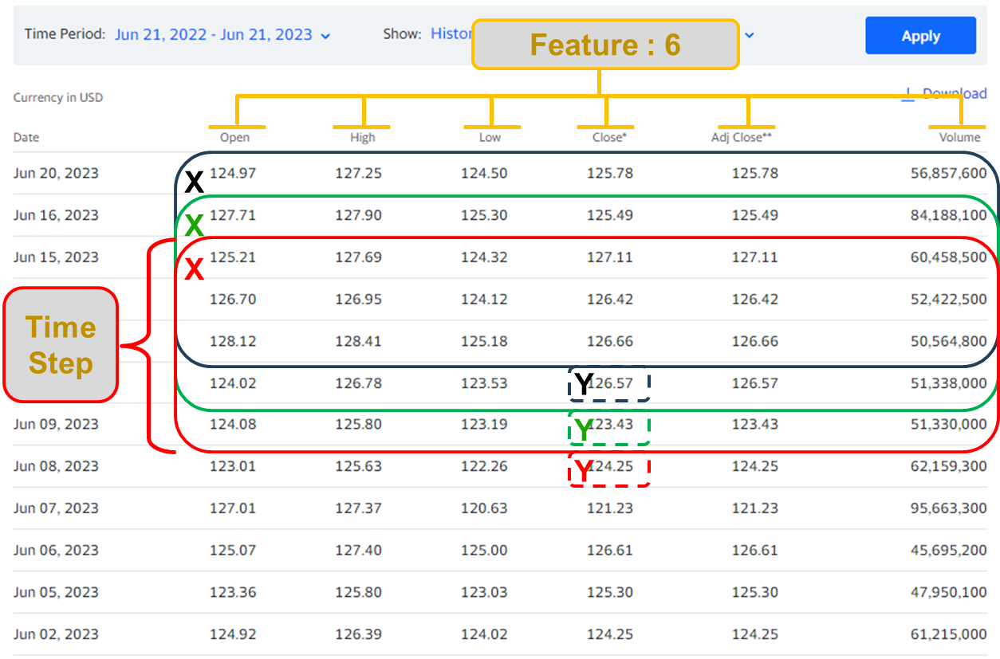
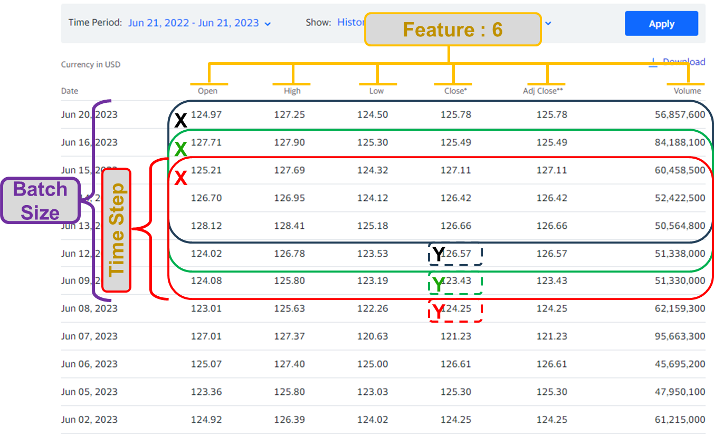
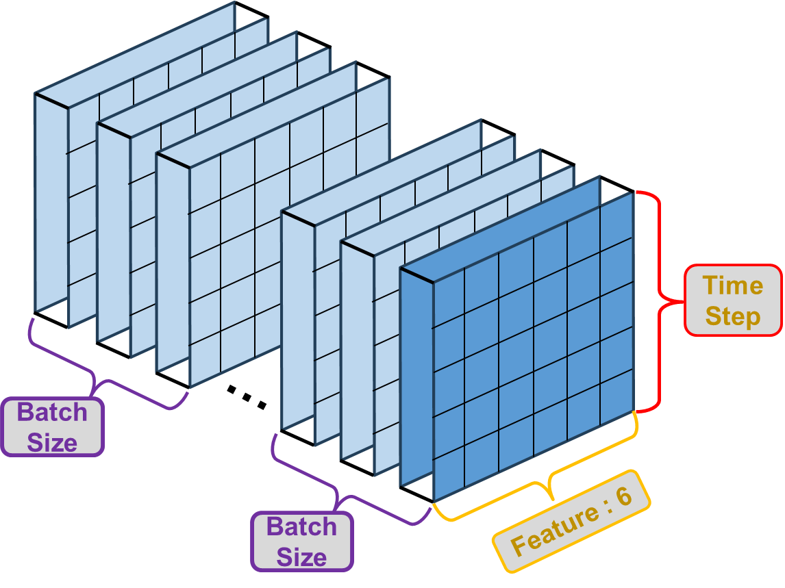
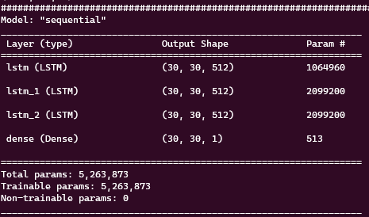
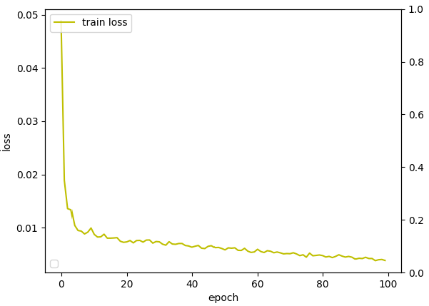

# LSTM 의 Input Shape정리

Tensorflow [Keras] 에서 LSTM을 사용할 때 봤던 수많은 Error중 input_shape 과 batch_size에 대해 정리된 글이 있어서 참고해 정리해둔다.

[참고 블로그 : [https://swlock.blogspot.com/2019/04/keras-lstm-understanding-input-and.html](https://swlock.blogspot.com/2019/04/keras-lstm-understanding-input-and.html) ]

## 1. input_shape

우선 LSTM이 필요로 하는 Input data shape은 3-Demension의 데이터를 요구한다.

[Data Size, Time step, Features] 으로 구성된 3D array가 요구된다.

하지만 Tensorflow에서 제공하는 예제 또는 대부분 자료에서 input_shape을 지정할 땐 아래의 예시처럼 2개의 parameter를 입력한다.

```python
model.add(LSTM(units = nNeuron, input_shape = ( 30 ,1 )))
```

위 예시에는 Data size가 생략되어있는데, 이유는 실제로 들어오는 입력 데이터로 총 data size계산이 가능하기 때문에 입력을 생략하고 ( Time step, Features )만 입력하게 된다.

간단하게 예를 들어서 각 부분의 의미를 설명해보자.



[위 데이터 출처는 아마존의 일별 주식 시가, 고가, 저가, 종가, 총 볼륨을 포함하는 데이터다.]

위 그림은 5일치의 데이터와 1일 마감가를 1개의 세트로 학습시키려 할 때의 모습이다. 즉

```python
model.add(LSTM(units = nNeuron, input_shape = ( 5 ,6 )))
```

이 될 것이다. 데이터 사이즈는 총 데이터를 위 그림처럼 time_step크기로 묶고 1일 단위로 shift시키며 data set을 만들 때의 개수이다. 총 데이터의 row값과 time_step을 알면 계산 가능하기때문에 생략해 진행한다.

만약 단일 변수 데이터를 이용한다고 가정하면 feature값이 1이 되므로 LSTM의 구조는

```python
model.add(LSTM(units = nNeuron, input_shape = ( 5 ,1 )))
```

이 될 것이다.

## 2. batch_input_shape

LSTM에 입력 가능한 input_shape에 batch의 수를 함께 입력해 진행하는 방법이 있다.

여기서 batch란 모델이 학습할 때 한번에 입력해 처리 될 수 있는 데이터의 양을 뜻한다. 즉 batch_size가 3 이라면 아래 그림과 같다.



입체적으로 보면 아래와 같을 것 이다.



여기서 주의해야 할 점은, Batch Size는 Data size와의 관계에 주의해야 한다는 점이다.

정확하고 깊은 원리나 이유는 모르겠지만 Data size % Batch Size == 0 이어야 한다.

즉 Data size를 batch size로 나누었을 때, 나머지가 생기면 batch로 나눠 작업할 때 문제가 생긴다고 한다.

내가 업무를 진행하면서 마주한 문제점이 여기서 부터 생겨났다.

## Error : Incompatible shapes

우선 내가 구성한 단순한 구조의 LSTM이다.

```python
## Model structure build
model = Sequential()
model.add(LSTM(nNeuron, batch_input_shape=(batch_size, window_size, input_data_column), return_sequences = True, stateful = True, dropout = dropout))
model.add(LSTM(nNeuron, input_shape=(batch_size, input_data_column), return_sequences = True, dropout = dropout))
model.add(LSTM(nNeuron, return_sequences = True, stateful = True, dropout = dropout))
model.add(Dense(1))
# nNeuron = 512
# batch_size = 30
# window_size = 30
# input_data_column = 7
```

model summary는



로 많이 복잡하지 않은 모델구조이다. 여기서 내 test input의 shape은

```python
# (data_size, time_step, features )
TrainX shape : (1735, 30, 7)
TrainY shape : (1735, 30, 1)
```

로 처음에는 batch_size와 data_size의 관계를 생각하지 않고 바로 학습 시켰을 때, Epoch 1이 끝나자마자 다음과 같은 error가 나타났다.

```python
Node: 'sequential/lstm/mul'
Incompatible shapes: [25,30,7] vs. [30,30,7]
         {{node sequential/lstm/mul}} [Op:__inference_train_function_6923]
```

쉽게 이해하면, 입력된 shape (25, 30, 7)과 입력예정인 shape (30, 30, 7)이 다르다는 뜻이다.

분명 모든 trainX와 trainY의 dataset모든 shape을 확인할 때는 ‘25’라는 숫자가 없었다.

결국 batch_size와 data_size의 관계를 이해하게 되었고 ‘25’가 어디서 왔는지또한 다음 계산으로 알게 되었다.

```python
1735 % 30 = 25
# 1735를 30으로 나누면 나머지가 25.
# 즉 training의 마지막 iteration에서 들어온 data 묶음이(들어온 batch size) (25, 30, 7)
# 이 된 것이다.
```

해서 나머지가 생기지 않는 조합을 고려했고, 다음과 같은 data shape과 batch_size로 진행했더니

아무런 error없이 모든 학습이 안료되었다.

```python
# (data_size, time_step, features )
TrainX shape : (1720, 30, 7)
TrainY shape : (1720, 30, 1)
batch_size : 40
# 1720 % 40 = 0
```

TMI로 아래그림은 batch_size에 의한 error를 해결하고 정상작동한 model training 결과다.



Epoch를 100개로 진행했고, 점점 떨어지는 loss의 느낌이 over training의 기운이 보여진다.

좀더 긴 Epoch로 확인하고 evaluation도 진행해봐야 하지만 그런 내일 하는걸로..
