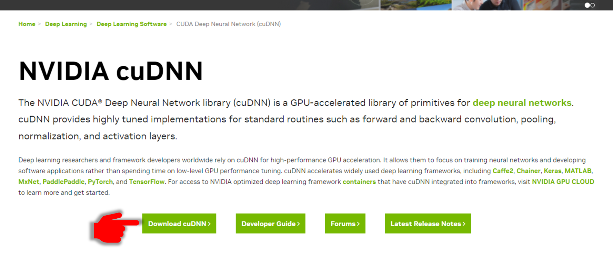
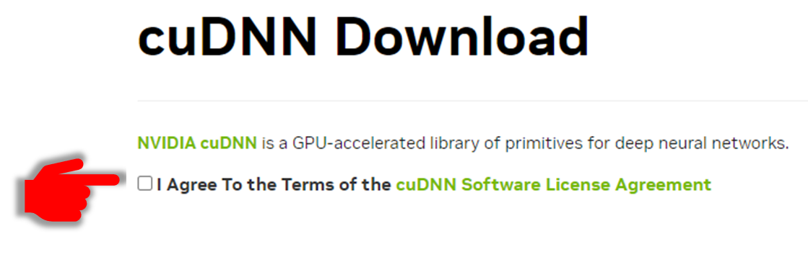
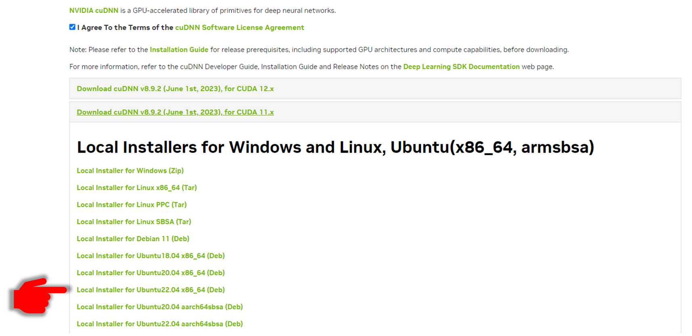
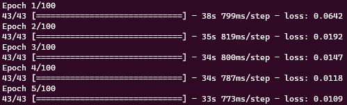
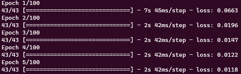

# cuDNN을 설치해보자

현재 내 OS는 Ubuntu22.04 다.

```bash
$ lsb_release -a
No LSB modules are available.
Distributor ID: Ubuntu
Description:    Ubuntu 22.04.2 LTS
Release:        22.04
Codename:       jammy
```

현재 내 tensorflow가 사용하는 device정보는 아래를 이용해 확인가능하다.

```python
from tensorflow.python.client import device_lib
print(device_lib.list_local_devices())
[name: "/device:CPU:0"
device_type: "CPU"
memory_limit: 268435456
locality {
}
incarnation: 4869179847153329558
xla_global_id: -1
]
```

현재는 CPU만 인식하는 모습이다. 이제 GPU도 사용가능하게 만들어야겠다.

참고로 나는 torch도 사용한다.

torch의 GPU 환경셋팅을 위해 CUDA 와 CUDA toolkit모두 설치가 되어있는 상태다. tensorflow에서도 사용하려면 cuDNN에 추가로 필요했기 때문에 여기선 cuDNN만 설치한다.

### package 다운받기

OS버전을 기억하고 Nvidia cuDNN홈페이지로 간다. [여기 [https://developer.nvidia.com/cudnn](https://developer.nvidia.com/cudnn)]

※ 모든 설명은 Ubuntu22.04 의 기준으로 설명됩니다.

1.  간단한 회원가입을 한다.

2.  Download cuDNN을 누른다

    

3.  동의를 누르고

    

4.  설치되어있는 CUDA버전에 맞는 cuDNN을 클릭하고, Ubuntu버전에 맞는 Deb(데비안) 파일을 다운로드 한다.
    [ ※ CUDA 버전 확인하는 법은 여기 : [https://zayunsna.github.io/blog/2023-06-19-Torch_error_1/](https://zayunsna.github.io/blog/2023-06-19-Torch_error_1/)]
    

여기까지가 준비물 준비 끝.

다음은 터미널로 진행한다.

다운 받은 데비안 파이 있는 위치로 이동후 아래 명령어를 하나씩 입력한다.

[※ 아래에서 x는 cuda의 상세 버전을, {key}는 생성된 local package key를 나타낸다.]

```bash
1. sudo dpkg -i cudnn-local-repo-ubuntu2208-8.x.x.x-1_amd64.deb

2. sudo cp /var/cudnn-local-repo-ubuntu2204-8.x.x.x/cudnn-local-{key}-keyring.gpg /usr/share/keyrings/

3. sudo apt-get update

4. sudo apt-get install libcudnn8

5. sudo apt-get install libcudnn8-dev

6. sudo apt-get install libcudnn8-samples
```

우선 위 과정을 하면서 나는 install과정에서 에러를 마주했다.

### sudo apt-get install libcudnn8을 할 때 실패.

Nvidia 공식 install menual에는 아래와 같이 좀더 자세한 command를 안내한다.

```bash
sudo apt-get install libcudnn8=8.x.x.x-1+cudaX.Y
```

여기에서 x는 cuDNN의 버전, (X,Y)는 설치되어있는 CUDA의 version을 의미하고, 입력한 버전에 호환되는 library를 설치하는게 목적인 것 같다.

하지만 위에 명령어를 버전에 맞게 입력하니 아래와 같은 에러가 나왔다.

```bash
$ sudo apt-get install libcudnn8=8.9.2.26-1+cuda11.5
Reading package lists... Done
Building dependency tree... Done
Reading state information... Done
Package libcudnn8 is not available, but is referred to by another package.
This may mean that the package is missing, has been obsoleted, or
is only available from another source

E: Version '8.9.2.26-1+cuda11.5' for 'libcudnn8' was not found
```

분명 library를 manual로 key등록을 했는데 library를 찾을 수 없다고 한다. 이에 대한 Nvidia의 해결책은, 위 순서에서 2,3번을 반복후 다시 시도해보라는 것이었다.

하지만 다시 시도 해도 역시 찾을 수 없고, 1번부터 다시해봐도 찾을 수 없다고 한다.

그러다 구글링으로 발견한 한가지 매우 단순한 제안은 아래와 같다

```bash
$ sudo apt-get install libcudnn8
```

알 수 없게 믿음이 가는 인도형이 추천한 방법으로, 호환 여부를 떠나 library를 설치해 보는 방법이었다. 에라 모르겠다 우선 시도 고고..

```bash
$ sudo apt-get install libcudnn8
Reading package lists... Done
Building dependency tree... Done
Reading state information... Done
The following package was automatically installed and is no longer required:
  python3-neovim
Use 'sudo apt autoremove' to remove it.
The following NEW packages will be installed:
  libcudnn8
0 upgraded, 1 newly installed, 0 to remove and 116 not upgraded.
Need to get 0 B/465 MB of archives.
After this operation, 1162 MB of additional disk space will be used.
Get:1 file:/var/cudnn-local-repo-ubuntu2204-8.9.2.26  libcudnn8 8.9.2.26-1+cuda11.8 [465 MB]
Selecting previously unselected package libcudnn8.
(Reading database ... 73229 files and directories currently installed.)
Preparing to unpack .../libcudnn8_8.9.2.26-1+cuda11.8_amd64.deb ...
Unpacking libcudnn8 (8.9.2.26-1+cuda11.8) ...
Setting up libcudnn8 (8.9.2.26-1+cuda11.8) ...
```

Tada! 설치가 진행되었고 심지어 다운받아 key등록해 놓은 cuDNN버전(8.9.2.26)도 확실하게 잡아서 설치해주고있다.

cuda는 11.8로진행 되었는데, 설치된 버전이 11.5로 상위버전이라 크게 상관없을 것 같다.

[이전 포스트에서 CUDA는 버전에 예민하다고했는데… 뭐가 또 안되려나...]

아무튼 dev와 sample까지 설치 완료후 tensorflow에서 GPU를 인식하는지 확인해 보았다.

```python
from tensorflow.python.client import device_lib
print(device_lib.list_local_devices())

[name: "/device:CPU:0"
device_type: "CPU"
memory_limit: 268435456
locality {
}
incarnation: 1281441088951613533
xla_global_id: -1
, name: "/device:GPU:0"
device_type: "GPU"
memory_limit: 1937558734
locality {
  bus_id: 1
  links {
  }
}
```

CPU뿐만 아리나 GPU도 잘 잡아주고있는 걸 확인했다.

글의 길이는 생각보다 짧지만 library설치에서 마주친 에러 해결을 위해 2시간정도는 삽질했던 것 같다.

### [번외] GPU의 속도차이

기존 CPU를이용해서 7.4M의 parameter를 가진 LSTM모델을 학습시길때 1Epoch당 걸린시간



이번 cnDNN설치 후 tensorflow에서 GPU를 사용가능하게 한 후 시도 했을 때 시간.


역시 GPU!

기존 CPU 연산 시간보다 94.8% 정도 감소된 시간이 걸렸다. 35초에서 2초가 되는 기적!

이래서 사람들이 GPU뽕맛 보면 왜 GPU 머신 구축하고 싶어하는지 알겠다…
