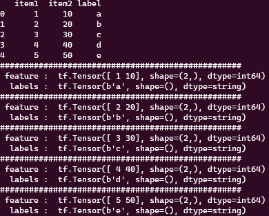
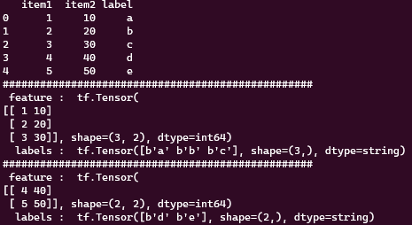
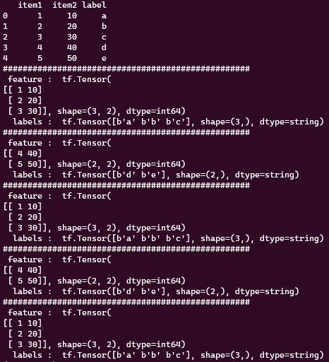
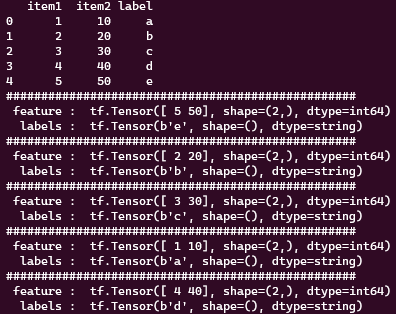
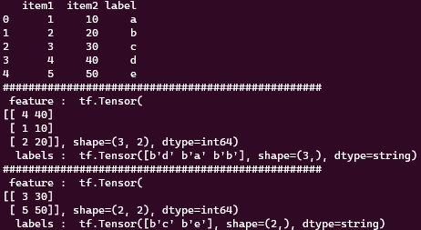

# Tensorflow의 Dataset 사용법 정리

모델 학습을 위한 Dataset을 만들때 사용하는 Tensorflow의 Dataset기능 중 가장 자주 사용하는 용어에 대해 정리해볼 생각이다.

Tensorflow의 Dataset은 데이터를 모델학습에 최적화 시킨 구조로 변환 및 가공하는 효율적인 API이다.

개인적인 기준으로 빈번하게 사용하는 함수는 아래와 같다.

1. from_tensor_slices()
2. take()
3. batch()
4. repeat()
5. shuffle()

위 나열된 5개의 기능이 각각 어떻게 작용하는지 코드와 출력문으로 기억과 이해하기 쉽게 정리해 둘 생각이다.

기본적으로 from_generator를 이용해서 tensorflow의 dataset format을 만들 수 있지만, 학습을 위해 data와 label을 나눌때 매우 편리하게 사용할 수 있는 from_tensor_slices를 이용해 dataset을 만들고 뒤에 함수들을 살펴보기로 하자.

## from_tensor_slices & take

뒤에 계속 사용할 데이터구조를 만들겸 from_tensor_slices와 take에 대해 설명해보겠다.

```python
import numpy as np
import pandas as pd
import tensorflow as tf

df = pd.DataFrame({'item1' : [1, 2, 3, 4, 5],
                    'item2' : [10, 20, 30, 40, 50],
                    'label' : ['a', 'b', 'c', 'd', 'e'] })

items = df[['item1','item2']]
labels = df['label']

## from_tensor_slices로 feature와 label을 아주 쉽게 매칭하고 데이터 구조를 설정 가능.
ts_dataset = tf.data.Dataset.from_tensor_slices((item, labels))

## take은 얼마만큼 tensor 개수를 가져올지 정한다.
## 아래의 경우 5개의 tensor를 가져온다는 뜻이다. 위 예제 dataframe의 경우 모두 다 가져온다.
for x, y in ts_dataset.take(5):
    print("#"*50)
    print(" feature : ", x)
    print("  labels : ", y)
```

아래 결과화면을 보면 좀더 직관적으로 ‘from_tensor_slices’가 어떻게 dataframe을 쪼개서 tensor뭉치를 만드는지 알 수 있다.

만약 위에 만든 데이터로 학습에 사용한다면, 입력 값(x)가 items 고 해당 라벨 값(y)가 labels가 되게 되고, 보통은 직접 slicing을 해서 사용하지만 ‘from_tensor_slices’는 더 쉽게 원하는 shape으로 학습 데이터 셋을 구성할 수 있다.



또한 take는 tensorflow 의 dataset에서 얼마만큼의 tensor양을 가져올지를 정한다. 위 예제에서 처럼 take(5)라면 총 5개의 tensor를 가져온다.

## batch()

batch(int)는 입력된 int argument만큼 미니배치로 분할한다.

```python
ts_dataset = tf.data.Dataset.from_tensor_slices((item, labels))
## 3개씩 tensor를 묶어서 미니배치를 생성.
ts_dataset = ts_dataset.batch(3)

for x, y in ts_dataset.take(5):
    print("#"*50)
    print(" feature : ", x)
    print("  labels : ", y)
```



3개의 tensor를 1개의 batch로 묶는다. 여기서 batch란 학습에 입력될 때, 한번에 들어가는 양을 의미한다.

추가로 3개의 tensor끼리 묶었기 때문에 총 5개의 tensor를 가진 예제에선 3개 2개로 나눠서 총 2개의 batch가 생성되었다.

take(5)로 총 5개를 가져와야하지만 2개의 batch로 묶였기 때문에 2개의 출력문이 생성되었다.

## repeat()

repeat()은 데이터셋을 반복하여 학습의 epoch만큼 수를 제공한다. 이렇게 하면 한번의 epoch동안 모든 데이터를 사용할 수 있으며, 반복하여 데이터를 공급할 수 있다.

```python
ts_dataset = tf.data.Dataset.from_tensor_slices((item, labels))
## 3개씩 tensor를 묶어서 미니배치를 생성.
ts_dataset = ts_dataset.batch(3).repeat()

for x, y in ts_dataset.take(5):
    print("#"*50)
    print(" feature : ", x)
    print("  labels : ", y)
```



기존에 batch(3)을 이용해 5개의 tensor를 2개의 배치로 묶었을 땐, take(5)로 배치 수 보다 큰 수를 불러오게 하더라도 총 2개 밖에 출력되지 않았다. 하지만 repeat을 하게된다면 조건이 만족 할 때까지 반복해서 생성하고 출력하는 것을 볼 수 있다.

주의해야 할 점, repeat을 이용해 반복하는 와중 take으로 범위를 조건으로 주지 않으면 무한으로 데이터셋을 반복해서 불러온다.

💡 from_tensor_slices와 repeat을 사용하게 된다면, 기존 post했던 [LSTM shape](https://zayunsna.github.io/blog/2023-06-21-LSTM_shape) 에 내용중 data size%batch_size == 0 과 같은 부가적인 단계를 고민하지 않아도 된다. 항상 같은 shape을 입력해야 하는데 data를 batch_size만큼 나누었을 때 나머지가 생기면 마지막 batch의 data shape은 작기 때문에 학습도중 에러가 발생한다. 하지만 tensor화 시키고 repeat을 사용하게 된다면 그러한 문제를 아주 쉽게 해결 할 수 있다.

## shuffle()

말그대로 데이터 셋을 무작위로 섞는다. 보통 shuffle(BUFFER_SIZE)의 형태로 사용하며 여기에서 ‘BUFFER_SIZE’는 섞기위해 사용되는 버퍼의 크기를 나타낸다. 일반적으로 ‘BUFFER_SIZE’는 데이터셋 보다 큰 값을 넣어 준다.

```python
ts_dataset = tf.data.Dataset.from_tensor_slices((item, labels))
## 3개씩 tensor를 묶어서 미니배치를 생성.
ts_dataset = ts_dataset.shuffle(10)

for x, y in ts_dataset.take(5):
    print("#"*50)
    print(" feature : ", x)
    print("  labels : ", y)
```



```python
ts_dataset = tf.data.Dataset.from_tensor_slices((item, labels))
## 3개씩 tensor를 묶어서 미니배치를 생성.
ts_dataset = ts_dataset.shuffle(10).batch(3)

for x, y in ts_dataset.take(5):
    print("#"*50)
    print(" feature : ", x)
    print("  labels : ", y)
```


