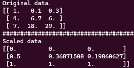
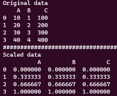
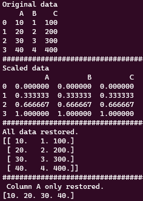
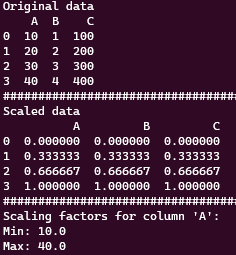

# MinMaxScaler 사용법

## Scaling 적용

MinMaxScaler는 Scikit-learn에서 제공하는 Normalizing API이다.

사용법은 매우 간단하여 numpy array와 pandas dataframe에 빠르게 적용할 수 있다.

가장 많이 사용하는 형식은 data를 0과 1사이로 normalizing하는 것으로, -1부터 1까지 하는 방식과 나란히 보편적으로 사용되고 있다. 사용법은 아래와 같다.

```python
import numpy as np
import pandas as pd
from sklearn.preprocessing import MinMaxScaler

## 예시 numpy array 생성
data = np.array([[1,  0.1,  0.3],
                 [4,  6.7,  6.0],
                 [7 , 18.0, 29.0]])

## MinMaxScaler 정의 [ feature_range로 normalization 범위를 0~1로 설정 ]
sc = MinMaxScaler(feature_range=(0,1))

## numpy array에 Scaler 적용
scaled_data = sc.fit_transform(data)
```

위 코드를 실행해서 전과 후를 출력해보면 아래와 같다.



각 열 별로 normalizing이 되는게 아닌 각 행별로 normalizing이 되는 것을 확인할 수 있다.

위에 예제로 부터 알 수 있는 건, MinMaxScaler의 input shape 은 ( n, 1 ) 이어야 한다. 즉 1차원 array의 경우 reshape(-1, 1)을 이용 shape을 변경해야 한다.

두번째로, numpy array뿐 아니라 pandas의 Dataframe에도 쉽게 적용 가능하다.

```python
import numpy as np
import pandas as pd
from sklearn.preprocessing import MinMaxScaler

## 예시 DataFrame 생성
data = {'A' : [10, 20, 30, 40],
        'B' : [1, 2, 3, 4],
        'C' : [100, 200, 300, 400]}

df = pd.DataFrame(data)

## MinMaxScaler 정의 [ feature_range로 normalization 범위를 0~1로 설정 ]
sc = MinMaxScaler(feature_range=(0,1))

## DataFrame에 Scaler 적용
scaled_data = pd.DataFrame(sc.fit_transform(df), columns = df.columns)
# 또는 scaled_data = sc.fit_transform(df)
```

아래는 결과.



## 원래 데이터로 복구

사용한 scaler factor를 사용하여 원래 값으로 복구하는 방법은 ‘inverse_transform()’을 사용한다.

한번 fit_transform으로 scaling이 진행되면 객체 ‘sc’는 각 column에 대한 scaling factor를 포함 Min & Max정보등을 기억하고 있다.

아래 예시 코드와 같이 원래 데이터로 복구할 수 있다.

```python
# 이전에 생성된 scaler 객체 사용하여 스케일링된 데이터 복구
restored_data = pd.DataFrame(sc.inverse_transform(scaled_data), columns=scaled_data.columns)
# 또는 restored_data = sc.inverse_transform(scaled_data)

# 특정 column에 대해서만 복구
column_name = 'A'  # 복구하려는 열의 이름
column_index = np.where(sc.get_feature_names_out() == column_name)[0][0]
restored_column = sc.inverse_transform(scaled_data)[:, column_index]

```

아래에 결과를 확인 할 수 있다.



특정 column에 대해서만 복구하는 건 그렇게 추천하는 방식은 아니다. 사용된 column의 개수가 매우 많고 모두를 handling하기엔 너무 무거울 때만 사용하는 방법이다.

작동방식은 ‘sc.get_feature_names_out()’를 사용하여 스케일링된 데이터의 열 이름을 확인한다. 그 다음, ‘np.where()’ 를 사용해 복구하고자 하는 열의 인덱스를 찾고 ‘inverse_transform()’을 이용해 복구한다. 이때, ‘[:, column_index]’ 부분을 ‘inverse_transform()’뒤에 추가하여 2차원으로 차원 맞춤을 해준다.

## Min & Max 값 가져오기

‘MinMaxScaler’를 사용해 데이터를 정규화 하면, 선언된 ‘MinMaxScaler’객체는 scaling factor와 동시에 정규화에 사용된 최대값(Max), 최소값(Min)도 기억하고 있다. 가끔 Scaler가 제대로 된 값을 최대 최소값으로 가지고 있는지 확인하는 작업이 필요한데, 이 때 최대 최소 값을 찾는 방법이다. 매우간단하지만 메모용도로 적어둔다.

```python
# 특정 열에 대한 스케일링 팩터 추출
column_name = 'A'  # 추출하려는 열의 이름
column_min = scaler.data_min_[df.columns.get_loc(column_name)]
column_max = scaler.data_max_[df.columns.get_loc(column_name)]
```


