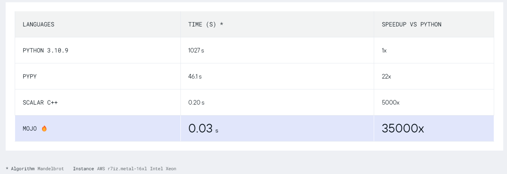

# Mojo가 모죠?

## Mojo가 모죠?

기존 Python은 사용자 친화적인 환경으로 C++ 못지 않게 엄청 많은 분야에서 사용되고 그 인기 또한 높았다. 하지만 Python의 가장 큰 단점 중 하나는 속도이다. C++에 비하면 수천 배(과장 살짝 해서..) 가 느리니 무거운 Job 을 돌리거나 sorting을 하면 좀 답답하다. Python3.11 이 업데이트 되었고 속도 면에서 엄청 큰 변화를 가져왔다. 실제로 사용해본 결과, 개인적으로는 체감이 가능한 수준 하지만 드라마틱 하게 빨라졌다는 느낌은 받지 못했다. 또 다른 단점으로는 Complie이 불가능 하다는 점이다. Complie 을 할 수 없어서 배포나 소스 코드 공유에 어려움이 많다. 매번 동작 환경을 고려하고 동일하게 설정해줘야 하기 때문이다.

이에 대한 대항마로, 현재 해외에서 뜨거운 감자인 새로운 프로그래밍 언어 Mojo가 등장했고, 인지지는 꽤 되었지만 이제 서야 정리를 할 수 있게 되었다.

Mojo는 파이썬의 상위 집합으로, 파이썬의 기능과 문법을 활용하면서 더 강력한 기능을 추가한다.

심지어 API호출을 이용해 C나 C++(추후 업데이트 예정이라고 한다) 에서도 Mojo engine 사용이 가능하다.

Mojo는 C++이나 Rust와 같이 빠른 속도를 원할 때 사용되는 언어다. 아래는 Mojo가 공개한 연산 속도 비교 결과이다. 비교 대상으로 python3.10과 빠른 python이라고 부르는 pypy 그리고 C++이다. 사용한 연산은 Mandelbrot이라고 적혀있는 것으로 보아 Mandelbrot을 특정 n번 까지 계산하는 것으로 추정된다. 결과는 매우 놀랍다. python3.10보다 35000배 빠르고, C++보다도 7배나 빠른 연산속도를 보여준다.

Mojo는 파이썬과 완벽하게 호환되며, 이미 존재하는 파이썬 패키지와 라이브러리도 Mojo에서 사용할 수 있다. 이 부분은 엄청난 이점인데, 개발자는 기존에 사용하는 코드를 한 줄의 수정 없이 속도를 비약적으로 증가 시킬 수 있다는 의미이다. Mojo는 파이썬과 유사한 문법을 가지지만, 일부 키워드와 문법은 다르다.

Mojo는 Multi-core에서 병렬 처리가 가능하다. 이 부분이 속도 향상 측면에서 가장 큰 효과를 보여준 것 같다.

Mojo는 AI를 위해 제작되기 시작한 언어다. 때문에 성능의 목표는 복잡도는 최대한 낮추면서 연산 성능은 C++ 또는 CUDA 급으로 향상시키는 것이라고 한다. Mojo는 현재 0.1 버전이며 아직 Class 를 지원하지 않으며 오픈소스가 아니다.

Mojo를 사용해보려면 초대장을 받기 위해 이메일로 가입해야 한다. 보통 3일 이내로 허가 메일이 오고, 자사에서 운영하는 jupyter note북을 이용해 여러 예시 코드를 실행, 테스트 해 볼 수 있다. 자사가 만들어 놓은 환경에서만 테스트 가능하다는 점이 조금 아쉽다. 각자의 환경에서 테스트를 해봐야 Mojo가 강조한 여러 강점들을 직접적으로 느끼고 확인할 수 있는데, real-world test가 불가능해서 Mojo측이 제시한 성능 지표가 실제 내 환경에선 어떨지는 잘 모르겠다. 그래도 swift만든 형님이 프로젝트 보스니 어느 정도 기대할만한 성능은 내줄 것 같다.

### Mojo 요약!

- 🔥 Mojo는 파이썬의 상위 집합으로, 파이썬의 기능과 문법을 활용하여 더 빠르고 강력한 프로그래밍 언어다.
- 🚀 Mojo는 C++이나 Rust와 같은 속도를 제공하여 파이썬보다 빠른 실행을 가능하게 한다.
- 💻 Mojo는 이미 존재하는 파이썬 패키지와 라이브러리를 사용할 수 있어 파이썬 생태계에 대한 접근성을 제공한다.
- 🔄 Mojo는 파이썬과 호환되며, Mojo 코드는 파이썬에서도 실행될 수 있다.
- 🧪 Mojo는 병렬 처리와 메모리 안전성을 위한 기능을 제공한다.
- 📝 Mojo는 Class 를 아직 지원하지 않으며 오픈소스가 아니다.
- 🆓 Mojo를 사용해보려면 초대장을 받기 위해 이메일로 가입해야 한다. [신청하러 가기!](<[https://www.modular.com/get-started](https://www.modular.com/get-started)>)

한 가지 매우 특이한 점은, mojo로 작성한 언어의 확장자다. 보통 python의 경우 확장자는 ‘.py’ 고 C++의 경우 ‘.cc’ 또는 ‘.cpp’로 저장한다. 반면에, mojo의 경우 ‘.mojo’ 와 불 이모지인 ‘.🔥’ (U+1F525)을 사용할 수 있다. 놀랍게도 이모지는 파일 확장자로 사용 가능하다 ;;;

## 참고 문헌

[1] [Moduler official blog](<[https://docs.modular.com/mojo/](https://docs.modular.com/mojo/)>)

[2] Mojo Playground - 가입 필요.

[3] [찐 파이썬 킬러?! 해외에서 난리난 언어 Mojo🔥 - 노마드 코더](<[https://www.youtube.com/watch?v=fYb2DkFo01U](https://www.youtube.com/watch?v=fYb2DkFo01U)>)
