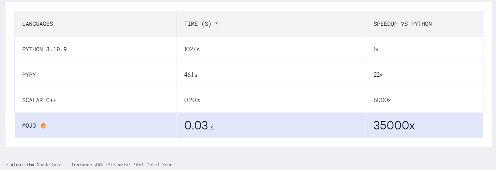

# Mojo 언어란? 설치부터 파이썬 속도 비교까지 (2026 업데이트)

> **Updated September 2026:** The first section below was added on 2026-09-29 and tested with Mojo 1.1.0. The rest of the post is the original 2023 write-up; outdated statements are marked.
{:.note}

## 2026년 현재 Mojo (1.1.0 기준 직접 실행)

2023년에 이 글을 쓸 때는 초대장을 받아 공식 플레이그라운드에서만 써볼 수 있었다. 지금은 다르다.

| | 2023년 (이 글 원문) | 2026년 9월 (확인) |
|---|---|---|
| 사용 방법 | 초대장 신청 후 공식 Jupyter 플레이그라운드 | `uv pip install mojo` 한 줄로 로컬 설치 |
| 버전 | 0.1 | 1.1.0 (PyPI, 2026-09-17) |
| 오픈소스 | 아님 | 공식 문서 첫 화면에 "Mojo is now open source!" 공지 |
| 클래스 | 미지원 | **여전히 미지원** (아래 실행 결과), 대신 `struct` |

### 설치와 실행

```bash
uv venv && uv pip install --python .venv/bin/python mojo
.venv/bin/mojo --version        # Mojo 1.1.0 (8189361e)
```

`struct`는 잘 동작하고, `class`는 컴파일 에러가 난다:

```mojo
struct Point:
    var x: Int
    var y: Int

    def __init__(out self, x: Int, y: Int):
        self.x = x
        self.y = y

def main():
    var p = Point(3, 4)
    print("struct works:", p.x * p.x + p.y * p.y)
```

```
struct works: 25
```

```
class_test.mojo:1:1: error: classes are not supported yet
```

### 파이썬보다 얼마나 빠를까? (직접 측정)

1부터 30만까지 각 수의 콜라츠 수열 단계 수를 모두 더했다. 반복 횟수를 실행할 때 입력받아서 컴파일러가 답을 미리 계산하지 못하게 했다.

```python
import sys, time

def total_steps(n):
    total = 0
    for start in range(1, n + 1):
        x = start
        while x != 1:
            x = x // 2 if x % 2 == 0 else 3 * x + 1
            total += 1
    return total

n = int(sys.argv[1])
t0 = time.perf_counter()
print(f"Python: {total_steps(n)} steps in {time.perf_counter() - t0:.2f} s")
```

```mojo
from std.sys import argv
from std.time import perf_counter_ns

def total_steps(n: Int) -> Int:
    var total = 0
    for start in range(1, n + 1):
        var x = start
        while x != 1:
            x = x // 2 if x % 2 == 0 else 3 * x + 1
            total += 1
    return total

def main() raises:
    var n = atol(argv()[1])            # read n at run time so the compiler can't precompute the answer
    var t0 = perf_counter_ns()
    var steps = total_steps(n)
    print("Mojo:", steps, "steps in", Float64(perf_counter_ns() - t0) / 1e9, "s")
```

```
Python: 35669725 steps in 1.13 s
Mojo: 35669725 steps in 0.072795 s
```

같은 답을 **약 16배** 빨리 냈다(Apple M5, Python 3.12.13, `mojo build`로 컴파일 후 실행). 아래 2023년 원문에 나오는 "35,000배"는 Modular가 공개한 Mandelbrot 벤치마크 수치로, 벡터화·병렬화까지 적용한 결과다. 평범한 반복문을 옮기기만 해서는 그 정도가 나오지 않는다.

### 직접 써보며 만난 함정 2가지

**1. `Int`는 64비트라서 조용히 넘친다.** 0부터 1억 미만까지 정수의 제곱을 모두 더하는 코드를 같은 코드로 계산했더니 결과가 달랐다. 에러도 경고도 없었다.

```
Python: 333333328333333350000000
Mojo:   662921401752298880
```

파이썬 `int`는 크기 제한이 없지만, Mojo의 `Int`는 64비트 정수라 범위를 넘으면 값이 틀어진다.

**2. 너무 단순한 벤치마크는 "0초"가 나온다.** 위 제곱합 코드는 Mojo에서 0.0초가 걸렸다. 반복 횟수가 코드에 고정돼 있으면 컴파일러가 반복문 자체를 계산식으로 바꿔버리는 것으로 보인다. 속도를 비교할 때는 입력을 실행 시점에 받고, 결과가 파이썬과 같은지 꼭 확인해야 한다.

## 2023년 원문: Mojo가 모죠?

기존 Python은 사용자 친화적인 환경으로 C++ 못지 않게 엄청 많은 분야에서 사용되고 그 인기 또한 높았다. 하지만 Python의 가장 큰 단점 중 하나는 속도이다. C++에 비하면 수천 배(과장 살짝 해서..) 가 느리니 무거운 Job 을 돌리거나 sorting을 하면 좀 답답하다. Python3.11 이 업데이트 되었고 속도 면에서 엄청 큰 변화를 가져왔다. 실제로 사용해본 결과, 개인적으로는 체감이 가능한 수준 하지만 드라마틱 하게 빨라졌다는 느낌은 받지 못했다. 또 다른 단점으로는 Complie이 불가능 하다는 점이다. Complie 을 할 수 없어서 배포나 소스 코드 공유에 어려움이 많다. 매번 동작 환경을 고려하고 동일하게 설정해줘야 하기 때문이다.

이에 대한 대항마로, 현재 해외에서 뜨거운 감자인 새로운 프로그래밍 언어 Mojo가 등장했고, 인지지는 꽤 되었지만 이제 서야 정리를 할 수 있게 되었다.

Mojo는 파이썬의 상위 집합으로, 파이썬의 기능과 문법을 활용하면서 더 강력한 기능을 추가한다.


심지어 API호출을 이용해 C나 C++(추후 업데이트 예정이라고 한다) 에서도 Mojo engine 사용이 가능하다.

Mojo는 C++이나 Rust와 같이 빠른 속도를 원할 때 사용되는 언어다. 아래는 Mojo가 공개한 연산 속도 비교 결과이다. 비교 대상으로 python3.10과 빠른 python이라고 부르는 pypy 그리고 C++이다. 사용한 연산은 Mandelbrot이라고 적혀있는 것으로 보아 Mandelbrot을 특정 n번 까지 계산하는 것으로 추정된다. 결과는 매우 놀랍다. python3.10보다 35000배 빠르고, C++보다도 7배나 빠른 연산속도를 보여준다.



Mojo는 파이썬과 완벽하게 호환되며, 이미 존재하는 파이썬 패키지와 라이브러리도 Mojo에서 사용할 수 있다. 이 부분은 엄청난 이점인데, 개발자는 기존에 사용하는 코드를 한 줄의 수정 없이 속도를 비약적으로 증가 시킬 수 있다는 의미이다. Mojo는 파이썬과 유사한 문법을 가지지만, 일부 키워드와 문법은 다르다.

Mojo는 Multi-core에서 병렬 처리가 가능하다. 이 부분이 속도 향상 측면에서 가장 큰 효과를 보여준 것 같다.

Mojo는 AI를 위해 제작되기 시작한 언어다. 때문에 성능의 목표는 복잡도는 최대한 낮추면서 연산 성능은 C++ 또는 CUDA 급으로 향상시키는 것이라고 한다. Mojo는 현재 0.1 버전이며 아직 Class 를 지원하지 않으며 오픈소스가 아니다. *(2023년 기준. 2026년 9월 현재 1.1.0이며 오픈소스이고, 클래스는 여전히 지원하지 않는다.)*

*(2023년 기준. 지금은 초대장 없이 `uv pip install mojo`로 설치할 수 있다.)* Mojo를 사용해보려면 초대장을 받기 위해 이메일로 가입해야 한다. 보통 3일 이내로 허가 메일이 오고, 자사에서 운영하는 jupyter note북을 이용해 여러 예시 코드를 실행, 테스트 해 볼 수 있다. 자사가 만들어 놓은 환경에서만 테스트 가능하다는 점이 조금 아쉽다. 각자의 환경에서 테스트를 해봐야 Mojo가 강조한 여러 강점들을 직접적으로 느끼고 확인할 수 있는데, real-world test가 불가능해서 Mojo측이 제시한 성능 지표가 실제 내 환경에선 어떨지는 잘 모르겠다. 그래도 swift만든 형님이 프로젝트 보스니 어느 정도 기대할만한 성능은 내줄 것 같다.

### Mojo 요약!

- 🔥 Mojo는 파이썬의 상위 집합으로, 파이썬의 기능과 문법을 활용하여 더 빠르고 강력한 프로그래밍 언어다.
- 🚀 Mojo는 C++이나 Rust와 같은 속도를 제공하여 파이썬보다 빠른 실행을 가능하게 한다.
- 💻 Mojo는 이미 존재하는 파이썬 패키지와 라이브러리를 사용할 수 있어 파이썬 생태계에 대한 접근성을 제공한다.
- 🔄 Mojo는 파이썬과 호환되며, Mojo 코드는 파이썬에서도 실행될 수 있다.
- 🧪 Mojo는 병렬 처리와 메모리 안전성을 위한 기능을 제공한다.
- 📝 Mojo는 Class 를 아직 지원하지 않는다. (2023년엔 오픈소스가 아니었지만 2026년 현재 오픈소스다.)
- 🆓 ~~Mojo를 사용해보려면 초대장을 받기 위해 이메일로 가입해야 한다.~~ 2026년 현재는 [설치 페이지](https://mojolang.org/install/)의 안내대로 바로 설치할 수 있다.

한 가지 매우 특이한 점은, mojo로 작성한 언어의 확장자다. 보통 python의 경우 확장자는 ‘.py’ 고 C++의 경우 ‘.cc’ 또는 ‘.cpp’로 저장한다. 반면에, mojo의 경우 ‘.mojo’ 와 불 이모지인 ‘.🔥’ (U+1F525)을 사용할 수 있다. 놀랍게도 이모지는 파일 확장자로 사용 가능하다 ;;;

## 참고 문헌

[1] [Mojo 공식 문서](https://mojolang.org/docs/) — 2026-09-29 확인

[1-1] [Install Mojo](https://mojolang.org/install/), [mojo on PyPI](https://pypi.org/project/mojo/) — 1.1.0 (2026-09-17)

[2] Mojo Playground - 가입 필요. *(2023년 기준)*

[3] [찐 파이썬 킬러?! 해외에서 난리난 언어 Mojo🔥 - 노마드 코더](https://www.youtube.com/watch?v=fYb2DkFo01U)
