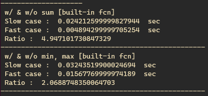
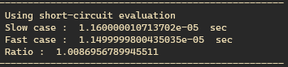
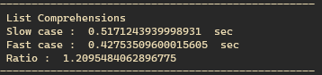
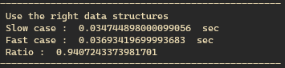
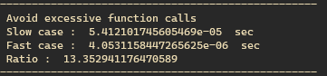
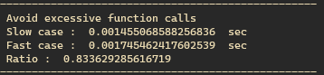

# Python의 비밀! Python의 속도를 빠르게 만드는 방법

이번 포스트는 한가지 흥미로운 글을 읽고나서 글에서 제시한 예시들을 직접 시도해본 결과이다.

참고한 포스트에는 7가지 python의 속도를 향상시키는 방법을 소개했다.

[Python Performance Hacks: 7 Ways to Speed Up Your Code by 92%](https://python.plainenglish.io/python-performance-hacks-7-ways-to-speed-up-your-code-by-92-2a0fe440735a)

실험 방법은,

- 각 비교할 방법을 넣은 두 개의 함수를 만든다.
- 각 함수가 작동하면서 걸린 시간을 timeit 을 이용해 측정한다.
- 100번 정도 함수 호출을 반복해 평균 시간을 계산한다. (timeit의 number parameter를 이용)
- 시간을 비교한다.

어떻게 보면 허술한 실험 세팅이다. 하지만 제시한 방법이 ‘92% 속도 향상’ 이 사실 이라면, 나의 대충 실험에서도 그 성능이 보여질 것 같았다.

[만약 내 실험이 잘못되었다면, 지적해주시면 감사하겠습니다.]

천천히 글을 읽고 제시한 코드를 간단하게 따라하면서 속도의 차이를 비교해봤다. 아래는 그 7가지 중 5개 방법의 실험 결과이다. 나머지 두 개는 신기하긴 하지만 잘 안 쓸 것 같아서..

### 1. 내장 함수 사용

포스트에서의 설명 : Python의 내장 함수인 len(), sum(), range() 등은 성능을 최적화 하도록 설계되었으며, 자체 구현을 작성하는 것보다 빠를 수 있다. 왜냐하면 이들은 C를 이용해 구현되어있어서 동등한 Python 코드보다 빠르다.

```python
my_list = [num for num in range(1, 10000)]

def run_slow(list_set):
    total = 0
    for num in list_set:
        total += num
    return total

def run_fast(list_set):
    return sum(list_set)

execution_time_slow = timeit.timeit(lambda: run_slow(my_list), number=100)
execution_time_fast = timeit.timeit(lambda: run_fast(my_list), number=100)

## 정수 10000까지의 숫자 list에서 각 component들의 합.
print(" w/ & w/o sum [built-in fcn]")
print(" Slow case : ", execution_time_slow, " sec")
print(" Fast case : ", execution_time_fast, " sec")
print(" Ratio : ", execution_time_slow/execution_time_fast)
print("-"*50)

def run_slow(list_set):
    max_value = my_list[0]
    min_value = my_list[0]
    for num in my_list:
        if num > max_value:
            max_value = num
        if num < min_value:
            min_value = num

    return max_value, min_value

def run_fast(list_set):
    return max(list_set), min(list_set)

execution_time_slow = timeit.timeit(lambda: run_slow(my_list), number=100)
execution_time_fast = timeit.timeit(lambda: run_fast(my_list), number=100)

## 정수 10000까지의 숫자 list중에서 min max값 찾기.
print(" w/ & w/o min, max [built-in fcn]")
print(" Slow case : ", execution_time_slow, " sec")
print(" Fast case : ", execution_time_fast, " sec")
print(" Ratio : ", execution_time_slow/execution_time_fast)
print("-"*50)
```

아래는 실행 결과이다.



이건 놀랍기도 하면서 너무 예상되던 결과다. 물론 sum(), min(), max()와 같은 함수의 source code를 보면 원리는 많이 다르진 않을 것 같다. 하지만 빌드된 언어가 C이고 이미 최적화 되어있는 함수이므로 내가 호다닥 작성한 무식한 코드보다는 빠를 것이다. 결과가 말해주듯 sum()의 경우 약 5배, min, max의 경우 2배가량 속도 향상이 있었다.

### 2. 불필요한 계산 피하기

포스트에서의 설명 : 반복된 계산의 결과를 캐싱하고 불린 표현식에서 단락 평가를 사용하여 불필요한 계산을 피함으로써 성능을 향상시킬 수 있다.

솔직히 ‘불필요한 계산 피하기’의 내용은 잘 모르겠다. 이름만 보면 너무나 당연하고 지키기만 한다면 그 성능이 확실히 오를 것 같은 느낌이다. 하지만 글에서 제시한 예제 코드는 큰 의미 없는 구조로 보였다. 특히 첫 번째 예제인 caching은 예제 작성한 의미를 모르겠으므로 패스하겠다.

```python
def run_slow(num):
    if num > 0 and num % 2 == 0:
        return True
    else:
        return False

def run_fast(num):
    if num <= 0 or num % 2 != 0:
        return False
    else:
        return True
execution_time_slow = timeit.timeit(lambda: run_slow(10), number=100)
execution_time_fast = timeit.timeit(lambda: run_fast(10), number=100)

print(" Using short-circuit evaluation")
print(" Slow case : ", execution_time_slow, " sec")
print(" Fast case : ", execution_time_fast, " sec")
print(" Ratio : ", execution_time_slow/execution_time_fast)
print("-"*50)
```

위의 예제는 ‘or’대신 ‘and’를 사용해서 두 개의 조건 중 첫 번째 조건만으로 결과를 확인 할 수 있게 해 ‘불필요한 계산’을 줄일 수 있고 속도 향상을 시킬 수 있다는 설명이다. 과연 그 결과는..



응~ 같아.

물론 조건이 위 예시와 같이 단순 비교처럼 간단하지 않거나 더 큰 resource를 사용한다면 차이가 있을 순 있겠다. 하지만 그 정도의 양 또는 복잡한 연산을 if에 조건 두 개를 넣고 사용하는 상황이 있을까 싶다.

### 3. for loop 에서 자주 사용하는 약식 표현식을 사용.

포스트에서의 설명 : 이들은 List와 Generator를 간결하고 효율적으로 생성하는 강력한 도구다. 특히 대규모 data-set을 처리할 때 전통적인 for loop를 사용하는 것보다 빠를 수 있다.

이건 해봐야 알 것 같았다. 약식으로 작성된 loop가 처음 python을 배울 때 작성한 for loop보다 얼마나 빠른지 감이 오지 않았다. python에서 for loop은 상당히 느리다고 배웠다. 왠만하면 많이 사용하지 말아야 한다고 알고있었기 때문에 기대가 되었다.

코드를 한번 봐보자.

```python
def run_slow():
    my_list = []
    for num in range(1,100000):
        if num % 2 ==0:
            my_list.append(num)
    return my_list

def run_fast():
    my_list = [num for num in range(1, 100000) if num % 2 == 0]
    return my_list

execution_time_slow = timeit.timeit(lambda: run_slow(), number=100)
execution_time_fast = timeit.timeit(lambda: run_fast(), number=100)

print(" List Comprehensions")
print(" Slow case : ", execution_time_slow, " sec")
print(" Fast case : ", execution_time_fast, " sec")
print(" Ratio : ", execution_time_slow/execution_time_fast)
print("-"*50)
```

my_list 라는 비어있는 list에 1부터 십 만까지 숫자를 단순히 넣는 방식으로 시간을 계산했다. 중간에 if문을 추가해서 약간의 복잡성을 추가했다. 아래는 결과이다.



약식을 쓴 경우가 약 1.2배 빨랐다. 십 만까지 사용해 그렇게 빨리 끝나지도 않았고, 100번 반복 시행한 후 평균 값 이라, 결과가 단순 우연은 아닐 것이다. 즉 일반적인 for loop보다 약식이 어느 정도 속도 향상을 보이는 것은 맞는 이야기인 것 같다. 실제 프로젝트에서 20% 속도 향상은 꽤 크게 느껴지니 앞으로 틈틈히 사용 해야겠다.

### 4. 적절한 데이터 구조 사용.

포스트에서의 설명 : 적절한 데이터 구조를 선택하는 것은 코드 성능에 중요한 영향을 미칠 수 있다. 예를 들어, Membership test에 list 대신 set를 사용하는 것이 훨씬 빠를 수 있다. set는 hash table 로 구현되기 때문.

우선 설명만 들어보면 나름 고개를 끄덕일 수 있다. 음 그럴 수 있지.. 하지만 해보고 싶었다. 그 차이가 어떻게 나타나는지 궁금했다.

```python
my_list = [num for num in range(1, 10000)]
my_set = set(range(10000))

def run(lnput_item):
    count = 0
    for num in lnput_item:
        if num%3 == 0:
            count += 1
    return count

execution_time_slow = timeit.timeit(lambda: run(my_list), number=100)
execution_time_fast = timeit.timeit(lambda: run(my_set), number=100)

print(" Use the right data structures")
print(" Slow case : ", execution_time_slow, " sec")
print(" Fast case : ", execution_time_fast, " sec")
print(" Ratio : ", execution_time_slow/execution_time_fast)
print("-"*50)
```

위와 같이 list와 set을 생성 후 각 1부터 만까지 숫자를 넣었다. 단순한 계산으로 moduler operator(나머지 연산자)를 넣어서 3으로 나누었을 때 나머지가 0일 경우만 숫자를 센다. 아래는 실험 결과이다.



내가 실험 설계를 잘 못한 것 같다는 기분이 든다. 참고한 포스트에서는 set으로 사용할 때 속도가 더 빨라진다고 했는데… 아마 내가 단순한 membership test를 하지 않고 뭔가 연산을 해서 그런 것일 수도 있겠다. 더 나은 실험 설계가 있는지 다른 방식으로 도전해 봐야겠다.

아무튼 결과는 set의 경우가 6% 느려졌다.

### 5. 불필요한 함수 호출 피하기

포스트에서의 설명 : Python에서 함수 호출은 상대적으로 비용이 많이 들 수 있다. 특히 함수가 동적으로 조회 되어야 할 때 조심해야 한다. 코드를 최적화 하려면 함수 호출 횟수를 최소화하려고 노력 해보자.

말해 뭐하나. 지당하신 말씀이다. ‘불필요한 연산 피하기’의 확장 버전이다. 함수를 호출 한다는 것은 함수 내부에 있는 연산 전부를 수행한다는 뜻이므로, 어쩌면 ‘불필요한 연산’의 경우 보다 시간이 길어질 수 있다.

```python
print(" Avoid excessive function calls")
def my_function(num):
    return num*num
import time
s_t = time.time()
my_list = [1, 2, 3, 4, 5]
total = 0
for num in my_list:
    total += num * my_function(num)

e_t = time.time()
execution_time_slow = e_t-s_t
print(" Slow case : ", execution_time_slow, " sec")

# With optimization

s_t = time.time()
my_list = [1, 2, 3, 4, 5]
total = 0
results = [my_function(num) for num in my_list]
for num, result in zip(my_list, results):
    total += num * result

e_t = time.time()
execution_time_fast = e_t - s_t
print(" Fast case : ", execution_time_fast, " sec")
print(" Ratio : ", execution_time_slow/execution_time_fast)
print("-"*50)
```

이번엔 함수를 만들어서 함수 호출로 계산하지 않고 예제 그대로 따라해봤다. 연산 시간은 ‘time’ 함수를 이용했다.



결과는 optimized된 방식이 계속 호출하는 방식보다 무려 13배 빨랐다.

여기서 나는 한 가지 궁금증이 생겼다. 위 예제는 my_list안에 5개의 원소만 넣어둔 상태로 진행했다. 즉 list 의 size가 작다. 만약 극단적으로 키운다면 연산 속도가 어떻게 변할까..

그래서 my_list를 10000 까지 채워서 진행해보았더니 결과는,



아무래도 optimization의 경우 ‘results’를 미리 계산하기 위해 loop를 한번 더 도는 셈이 되니, list양이 많아 질 수록 중첩되는 효과가 일어나서 더 느려지는 결과를 보여주는 것 같다.

### 나머지 tip에 대한 간단 정리.

1. **계산이 많은 코드에 Cython 또는 Numba 사용**: Cython은 C로 컴파일되는 Python의 상위 집합이며, Numba는 Python 코드를 기계 코드로 컴파일할 수 있는 즉시 컴파일러이다. 두 도구 모두 계산이 많은 코드의 성능을 크게 향상시킬 수 있다.
2. **프로파일링을 사용하여 성능 병목 현상 식별**: 프로파일링은 코드 성능을 측정하고 가장 많은 시간을 차지하는 부분을 식별하는 기법이다. Python에는 cProfile과 profile과 같은 내장 프로파일링 도구가 있다. 이를 사용하여 코드의 느린 부분을 식별하고 최적화 할 수 있다.

### 결론.

- 가능하다면 **Python 내장함수**를 열심히 사용하자
- for loop는 무겁다. **약식 사용**에 익숙해 지자.

확실히 python의 속도를 올릴 수 있는 좋은 팁 들이 있었고, 각 팁마다 비교해 볼 수 있는 코드 아이디어를 제시해줘서 이해하기 편했다. 그 중에는 의미를 이해하기엔 좀 더 공부가 필요한 팁도 있었고, 몇개는 그 차이를 몸소 느낄 수 있었다. 확실히 느낀 점은 python - for loop는 정말 무겁다.
