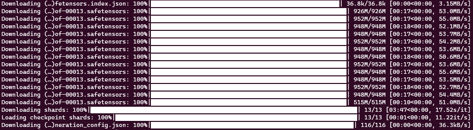
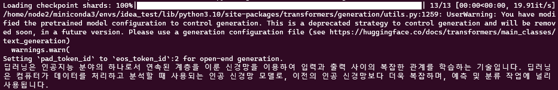
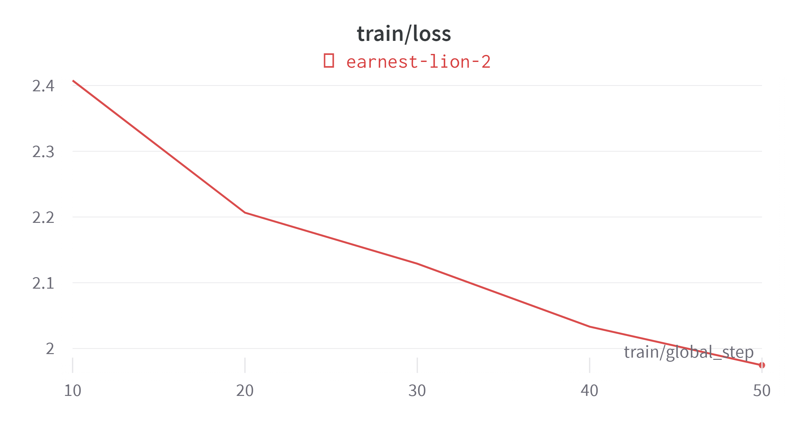
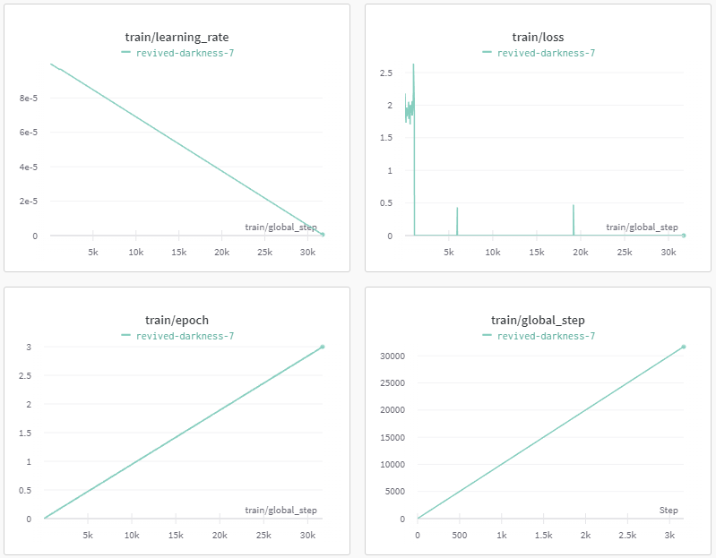
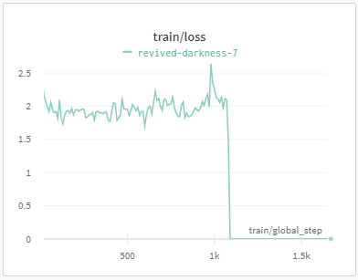
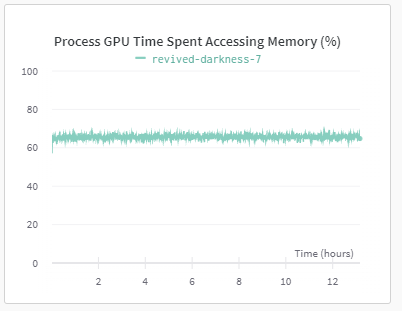
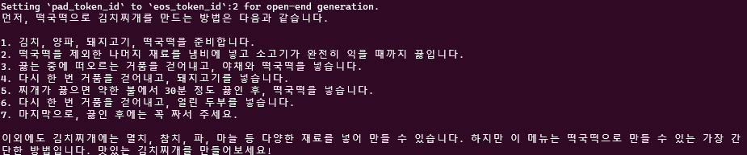

# KoAlpaca 에 대해 공부 - 1

NLP에 관심이 가기 시작하면서, 언어와 관련된 여러 AI 모델과 서비스에 대해 공부를 했다. Open AI 의 tokeninzing API와 langchain을 사용해서 문서를 요약하는 모델도 만들어 봤고, GPT API를 이용해 글을 풍성하게 다시 작성해주는 모델도 만들어봤다.

기존 존재하던 API를 이용하다가, 나만의 Local LLM을 만들어 보고 싶다는 생가기 들어서 시도해 보고 있는 중이다.

내가 시작하고자 했던 조건은,

1. 한국어 모델이어야 한다.
2. 너무 거대한 모델이면 부담스럽다.
3. 로컬에 저장하고 외부로 서브가 가능해야 한다.

좀 까다롭지만, 내가 가진 장비로 할 수 있는 한계를 전부 사용한다는 마인드로 여러 모델과 튜토리얼을 찾아보다가 발견한 KoAlpaca.

Standford에서 Meta의 LLamMA-7B모델을 fine-tuning한 Alpaca모델을 동일한 방식으로 *한국어*를 이용해 학습시킨, 한국어 모델이다.

[KoAlpaca GitHub](https://github.com/Beomi/KoAlpaca)

[KoAlpaca 공식 Doc](https://docs.koalpaca.com/)

위에 있는 git의 Readme에 엄청 친절한 설명이 있어서, 어떻게 모델을 사용하고 fine-tuning 할 수 있는지 나와있다.

LLM을 학습하기엔 엄청나게 큰 컴퓨팅 리소스가 필요하다. 때문에 OpenAI나 Google, Meta, MS와 같은 Big-Tech기업이 고성능 LLM에 선두에 있고, 소규모 LLM의 업데이트가 더디게 된 이유이다. 나 역시 개인이기 때문에 (Colab pro도 아니고..) 물리적인 학습 환경의 한계를 이겨내고 fine-tunning 해보기 위해 이것저것을 시도 하고있다.

먼저 huggingface에 있는 모델을 불러와서 작동해보는 예제코드를 냅다 실행해 보았다.

```python
import torch
from transformers import pipeline, AutoModelForCausalLM

MODEL = 'beomi/KoAlpaca-Polyglot-5.8B'

model = AutoModelForCausalLM.from_pretrained(
    MODEL,
    torch_dtype=torch.float16,
    low_cpu_mem_usage=True,
).to(device=f"cuda", non_blocking=True)
model.eval()

pipe = pipeline(
    'text-generation',
    model=model,
    tokenizer=MODEL,
    device=0
)

## 모델 저장 하기
model.save_pretrained("./KoAlpaca_v1.1_save")

def ask(x, context='', is_input_full=False):
    ans = pipe(
        f"### 질문: {x}\n\n### 맥락: {context}\n\n### 답변:" if context else f"### 질문: {x}\n\n### 답변:",
        do_sample=True,
        max_new_tokens=512,
        temperature=0.7,
        top_p=0.9,
        return_full_text=False,
        eos_token_id=2,
    )
    print(ans[0]['generated_text'])

ask("딥러닝이 뭐야?")

```

이 코드는 위에 첨부한 KoAlpaca gitbuh의 README에도 있는 실행 예제 코드다. 내가 추가한 것은, 모델을 Local로 다운받아서 fine-tuning한 후 저장하기 위해 모델을 저장하는 코드 한 줄 추가한 것.

위의 예제가 첫 실행이라면, Alpaca model을 safetensor로 쪼개놓은 파일들을 다운받기 시작할 것이다. (단일 파일 크기가 너무 커서, 쪼개지 않으면 Ram이 터진다고 했다.)



약 12GB의 model이 다운로드 되어있고, huggingface의 configuration을 바꾸지 않는 이상 위 다운받아진 safetensor는 `~/.cache/huggingface/hib/models~~/blobs` 에 있다.

다운로드가 끝나면 checkpoint를 불러오고 `ask("딥러닝이 뭐야?")`에 답변이 나온다.



작동이 되는 것을 확인했으니, 이 모델을 가지고 fine-tuning manual을 따라서 실행하려고 보니, gpu의 ram이 부족해서 training 시작전에 터지고 말았다.

KoAlpaca-Polyglot-5.8B 에 v1.1a dataset을 학습 시키는데 beomi님이 사용한 환경을 보니 _A100 80GB_ 1대. 나는 RTX 3090 24GB… 택도 없다..

더불어서 KoAlpaca-Polyglot-12.B-v1.1b 모델의 경우 _A100 80GB_ 4대를 이용했다고 적혀있다.

batch를 더 쪼개는게 가능한가..? torch에서 GPU Mem사용량을 강제 할 수 있나? 여러 방법을 찾아보다가 QLoRA 4bit 학습방법을 시도하게 되었다.

### 4bit 학습방법 이란?

4비트 학습은 모델의 가중치를 계산 할 때, 각 가중치를 기존 32비트에서 4비트로 변환하여 저장하고 연산하는 방식이다. 가중치를 4비트로 줄이면서 사용하는 메모리 사용량을 줄이고 서비스 될 때 부담을 줄일 수 있는 방법이다.

물론 단점도 존재한다. 단순하게 가중치를 4비트로 낮추면, 학습이 잘 이루어지지 않거나 성능이 급감하는 현상이 발생할 수 있다. 이를 해결하기 위해 여러 기술이 있지만, 지금 생각나는건 double 또는 nf4 quantization이 있다.

메모리가 모델을 불러오는 데에도 허덕이고 있고, 마침 4bit 학습 예제도 있으니 진행해 봤다.

```python
import torch
import transformers
from transformers import AutoTokenizer, AutoModelForCausalLM, BitsAndBytesConfig
from peft import prepare_model_for_kbit_training, LoraConfig, get_peft_model
from datasets import load_dataset

def print_trainable_parameters(model):
    """
    Prints the number of trainable parameters in the model.
    """
    trainable_params = 0
    all_param = 0
    for _, param in model.named_parameters():
        all_param += param.numel()
        if param.requires_grad:
            trainable_params += param.numel()
    print(
        f"trainable params: {trainable_params} || all params: {all_param} || trainable%: {100 * trainable_params / all_param}"
    )

data = load_dataset("beomi/KoAlpaca-v1.1a")
data = data.map(
    lambda x: {'text': f"### 질문: {x['instruction']}\n\n### 답변: {x['output']}<|endoftext|>" }
)

model_id = "./KoAlpaca_v1.1_save"
bnb_config = BitsAndBytesConfig(
    load_in_4bit=True,
    bnb_4bit_use_double_quant=True,
    bnb_4bit_quant_type="nf4",
    bnb_4bit_compute_dtype=torch.bfloat16
)

tokenizer = AutoTokenizer.from_pretrained(model_id)
model = AutoModelForCausalLM.from_pretrained(model_id, quantization_config=bnb_config, device_map={"":0})
data = data.map(lambda samples: tokenizer(samples["text"]), batched=True)

model.gradient_checkpointing_enable()
model = prepare_model_for_kbit_training(model)

config = LoraConfig(
    r=8,
    lora_alpha=32,
    target_modules=["query_key_value"],
    lora_dropout=0.05,
    bias="none",
    task_type="CAUSAL_LM"
)

model = get_peft_model(model, config)
print("check Pretrained model's paramsters : ", print_trainable_parameters(model))

# needed for gpt-neo-x tokenizer
tokenizer.pad_token = tokenizer.eos_token

trainer = transformers.Trainer(
    model=model,
    train_dataset=data["train"],
    args=transformers.TrainingArguments(
        per_device_train_batch_size=2,
        gradient_accumulation_steps=1,
        # max_steps=50, ## 초소량만 학습: 50 step만 학습. 약 4분정도 걸립니다.
        learning_rate=1e-4,
        fp16=True,
        logging_steps=10,
        output_dir="outputs",
        optim="paged_adamw_8bit"
    ),
    data_collator=transformers.DataCollatorForLanguageModeling(tokenizer, mlm=False),
)
model.config.use_cache = False  # silence the warnings. Please re-enable for inference!
trainer.train()
```

원래 예제에는 `max_steps = 50`로 50 step 으로 학습을 제한해 두었다. 빠르게 training이 되는지 확인하고 검사하기 위해서 인 듯 하다.

50 step는 정말 빨리 끝났고 정상적으로 training이 되는 것을 확인.



_모델의 학습 과정과 모니터링은 wandb를 통해 확인가능하다!_

Test 용으로 학습시킨 dataset은 koalpaca v1.1다.

KoAlpaca 의 github를 clone하면 main dir에 있는 ‘KoAlpaca-v1.1.json’ 는 아닌 것 같다.

다음 테스트는 max_steps로 제한을 두지 않고 모든 데이터 셋을 학습 시켜보았다.



총 학습 시간은 13시간 반정도 걸렸다. 딱 봐도 알겠지만, 역시 한번에 되는 건 없는 것 같다. train/loss를 보면 1000 step에서부터 loss가 0이 되는 상황이 일어났고, 분명 무언가 문제가 있는 것 같다.



처음에는 학습을 시켜 놓고 자고 일어나는 과정에서 컴퓨터가 절전에 들어가서 그랬나 싶지만,



GPU monitoring 결과를 보면 계속해서 무언가를 하고 있었던 것 같다.

학습된 모델이 내 개인 huggingface repo에 있고, 불러와서 간단하게 질문 해 본 결과는 아래와 같다.



내 질문은 분명 “김치찌개 끓이는 법을 알려줘” 였다.

그럴듯한 답변을 작성해 줬지만 완전 이상한 말을 하고 있다. hallucination 인 것 같다.

즉 loss가 0이 되는 순간부터 학습이 안된 것 뿐만 아니라 이상한 가중치가 계산되어 저장된 것 같다.

이유를 찾기 위해 이것저것 해보는 중이라 혹시 해결책을 찾게 된다면 2탄으로 업로드 해보겠다.
