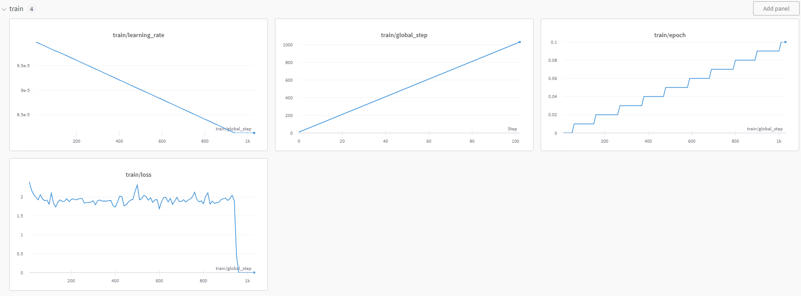

# KoAlpaca 에 대해 공부 - 2

회사 업무로 바빠서 제대로된 시도를 못해보다가 드디어 짬이 생겼다.
지난번 포스트 이후 상황에대해 조금더 진행해 보기 위해 training size을 조정해가면서 조사를 시작했다.

## Remind for KoAlpaca - 1

[KoAlpaca GitHub](https://github.com/Beomi/KoAlpaca)
위 공식 KoAlpaca Github에 자세히 설명되어있는 Tutorial을 따라 모델을 다운로드 및 테스트를 진행했고,
Find tuning을 위해 개인 huggingface repo를 생성, 제공된 dataset을 이용해 4bit학습 방법 으로 진행해 보았다.

처음 학습이 되는지 확인하는 과정으로, 공식 Github에 제시된 매우 작은 단위의 training을 진행했고, 결과는 안내된 것 과 동일하게 문제없이 학습되었다.
[KoAlpaca 에 대해 공부 - 1](https://zayunsna.github.io/blog/2023-08-01-koalpaka/)

코드가 작동하는 것을 확인해 `max_steps = 50` 을 주석 처리 함으로써, 모든 데이터셋을 학습시켜 보려 했고, 총 13시간 반이 걸려 학습 (RTX3090 32GB 1개 사용)이 마무리 되었지만, 초반 1/5지점에서 training loss 가 0으로 수렴 overfitting 증상을 보였다. 이를 조사하기 위해 여러 테스트를 진행해 보았다.

## 조사 시작

지난번 전체 dataset에 대한 학습중 step이 대략 1.2k쯤 0으로 떨어졌다.

첫번째로, 동일한 구간에서 0으로 다시 떨어지는지 Reproducing을 진행해봤다.

`Transformers.Trainer` 함수의 `max_steps` 를 조정, 넉넉하게 5000으로 시작했다.

```python

## Model Training configuration
trainer = transformers.Trainer(
	model = model,
	train_dataset=data["train"]
	args=transformers.TrainingArguments(
		per_device_train_batch_size = 2,
		gradient_accumulation_steps = 1,
		max_steps = 5000,
		learning_rate = 1e-4,
		fp16 = True,
		logging_steps = 10,
		output_dir = "outputs",
		optim = "paged_adamw_8bit"
	),
	data_collator = transformers.DataCollatorForLanguageModeling(tokenizer, mlm=False)
)
```





step 이 1000이 넘는 순간, training loss는 0이 되고 learning rate는 변하지 않게된다.

느낌이 안좋은게 저번엔 확실히 1000을 넘었기 때문이다.

확실히 하기 위해 한번더 진행했다. 이번엔 5000이 아니라 1000만 진행해보기로.

1000이 Threshold라면 그아래는 안정적이어야 어느정도 이해가 될 것 같았기 떄문이다.


training loss가 0이되는 기준은 Dataset이나 model이 아닌 환경과 관련되 느낌인 것 같다.

이번에는 500이 조금 넘은 시점에서 training loss가 0이 되었다.

좀더 다양한 `max_steps`를 조절해서 규칙이 있나, 진짜 환경의 문제인가 확인해보았다.

```python
data = load_dataset("beomi/KoAlpaca-v1.1a")
model_id = "beomi/polyglot-ko-12.8b-safetensors"
##
# 중간 생략 자세한 코드는 KoAlpaca 공부 1 참고.
##
config = LoraConfig(
	r = 8,
	lora_alpha = 32,
	target_modules = ["query_key_value"]
	lora_dropout = 0.05,
	bias = "none",
	task_type = "CAUSAL_LM"
)

## Model Training configuration
trainer = transformers.Trainer(
	model = model,
	train_dataset=data["train"]
	args=transformers.TrainingArguments(
		per_device_train_batch_size = 2,
		gradient_accumulation_steps = 1,
		max_steps = 50, # 500, 600, 1000, 2000, 5000 로 변경하면서 츄라이.
				# 왜냐하면 이전 시도에서 모든 step을 학습했을 때, step이 1200쯤 training loss가 0이 되었다.
				# max_steps을 그쯔음으로 설정 후 같은 현상이 재현 되는지 확인하기 위해 여러 다른 max_step을 시도.
		learning_rate = 1e-4,
		fp16 = True,
		logging_steps = 10,
		output_dir = "outputs",
		optim = "paged_adamw_8bit"
	),
	data_collator = transformers.DataCollatorForLanguageModeling(tokenizer, mlm=False)
)
```


## 현재의 의문점 1

특별한 규칙성이 안보인다. 500, 1000, 1200, 또 어떨때는 정해진 step을 다 완료할 때까지 0으로 떨어지는 일이 없었다.

이번 실험을 위해 max_step의 변경 외에는 그 어떠한 것도 변경하지 않았다.

실험환경 통제!

training target pre-trained model도 동일하고 (개인적으로 학습된 모델을 불러와 재 학습 하지 않았다.)

training dataset도 셋 모두 동일하다.

학습 환경도, 심지어 내 방의 온도 습도도 모두 큰 오차 없이 동일하다.

단지 max_step을 점점 늘려봤을 뿐이다.

중간에 왜 loss가 0으로 떨어지는지, 0으로 떨어지는 부분이 일관성이 없는지, 왜 training_rate은 제각각인지 확인을 하고 있지만, 감이 잡히지 않는다.

한 가지 특이한 점은, training loss 확대 부분을 보면 모든 모델의 loss 흐름이 거의 비슷하다는 것이다.

## 현재의 의문점 2

KoAlpaca공식 Github에도 동일한 dataset을 이용한 training결과가 첨부되어있다.

물론 모델이 Polyglot이 아닌 LLama이긴 하지만 어느정도 improvement가 보인다. train loss가 일정 주기를 가지면서 점점 낮아지는데, 내 결과 특히 `max_steps=2000` 의 결과를 보면 step 100 이후로는 loss가 1.9를 기점으로 변동되지 않는다.

## 결론

더 길게 조사를 그리고 다양한 방법으로 더 자세히 하나하나 확인해보고 싶지만 또 언제 짬이 날지 모르겠다.
우선 한가지 확실한건,

- loss가 0이되는 것
- loss가 0이 되지 않고 계속 진행되도 더이상 향상이 없다는 것

을 바탕으로 생각해 보았을 때 뭔가 한참 잘못 하고있는 것 같다.

KoAlpaca 에 대해 공부 3탄을 빠른시일내에 정리해서 올려보도록 하겠다.
