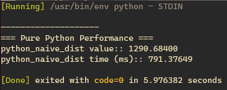

# Mojo가 모죠? - 2

Mojo는 Python의 상위 호환의 개념으로, Python사용자에게 매우 친숙할 것이라고 광고하고있다. 이번에는 Mojo의 최근 Post를 바탕으로, 간단한 Python 프로그램을 Mojo로 이식하면서 몇 가지 중요한 차이점을 확인해보겠다.

처음 Mojo가 세상에 공개되었을 때, 제일 사람들을 놀라게 한 부분은 ‘연산속도’ 였다. 현재의 Python은 느리지만 NumPy라는 강력한 연산 도구가 있어서 어느정도 속도에 대해 좋은 성능을 유지하고 있다. 그러나 NumPy의 내부를 살펴보면 모든 계산 집중 코드가 C/C++로 작성되어 성능이 나오는 곳임을 알 수 있다.

Mojo의 가장 큰 이점은, Mojo를 사용하면 Python과 같은 고수준 코드를 작성하고 메모리를 명시적으로 관리하고 유형을 추가하는 등 Mojo의 하위 수준 기능을 활용하여 C의 성능 (또는 더 좋은 성능)을 얻을 수 있다는 것이다. 이것은 여러 언어로 알고리즘을 작성할 필요가 없고 Mojo에서 양쪽의 장점을 모두 얻을 수 있다는 것을 의미한다.


Mojo는 아직 개발 초기 단계에 있으며 언어와 도구가 대규모 Python 프로젝트의 마이그레이션을 지원할 준비가 되지 않았다고 한다.

Mojo의 개발자 피셜로 추천하는 현재 mojo활용 방법으로는,

- 처음에는 자신의 코드 중 계산이 많이 필요한 작은 부분을 Mojo로 이식
- 언어와 도구가 성숙해지면 시간이 지남에 따라 코드 베이스의 더 중요한 부분을 마이그레이션

Mojo는 현재 매주 많은 새로운 언어 기능을 추가하고 있다.

### 간단한 예제로 보는 Mojo와 Python의 차이!

두 벡터 사이의 유클리드 거리를 계산하는 간단한 예제로 시작해 보겠다.

유클리드 거리는 두 점 사이의 거리를 나타내고, 이 거리를 사용하여 유클리드 공간을 정의할 수 있다. 직교 좌표계에서 유클리드 거리는 아래처럼 나타낼 수 있다.


유클리드 거리 계산은 Computing 및 Machine Learning에서 가장 기본적인 계산 중 하나로, k-nearest neighbors 및 유사성 검색과 같은 알고리즘에서 사용된다.

이번 예제에서는 고차원 벡터를 사용하여 이 작업에서 NumPy보다 빠른 성능을 얻는 방법을 확인해보겠다.

### **Mojo를 경험해 볼 수 있는 곳 - Mojo Playground!**

이 포스트에서 소개하는 모든 코드는 Mojo Playground의 새로운 Jupyter 노트북에 복사 및 붙여 넣으면서 함께 확인해 볼 수 있다.

Mojo Playground 접속해 경험해 볼 수 있는 방법은 기존 포스트에 설명되어있으니 참고바람!

[https://zayunsna.github.io/blog/2023-07-14-mojo_intro/](https://zayunsna.github.io/blog/2023-07-14-mojo_intro/)

### 유클리드 거리 계산 **알고리즘 구현**

유클리드(Euclidean) 거리를 계산하는 것은 상당히 간단하다.

1. 두 벡터 사이의 요소별 차이를 계산하여 차이 벡터를 만들고
2. 차이 벡터의 각 요소를 제곱하고,
3. 차이 벡터의 모든 제곱된 요소를 합산하고
4. 합의 제곱근을 취한다.

작업 순서는 아래 그림처럼 표현될 수 있고, 좀 더 쉽게 알고리즘의 구조를 이해할 수 있을 것이다.


여기서 n은 사용될 입력 array (또는 list)의 크기다.

위 알고리즘은 아래 Python code로 작성 될 수 있다.

```python
def python_naive_dist(a,b):
    s = 0.0
    n = len(a)
    for i in range(n):
        dist = a[i] - b[i]
        s += dist*dist
    return sqrt(s)
```

### 1번 주자 : **외부 package없이 Python로만 구현**

먼저 비교 기준으로, Python 코드만 사용해 유클리드 거리 계산에 대해 진행해 보겠다.

```python
%%python
import time
import numpy as np
from math import sqrt
from timeit import timeit

n = 10000000
anp = np.random.rand(n)
bnp = np.random.rand(n)

alist = anp.tolist()
blist = bnp.tolist()

def print_formatter(string, value):
    print(f"{string}: {value:5.5f}")

# Pure Python iterative implementation
def python_naive_dist(a,b):
    s = 0.0
    n = len(a)
    for i in range(n):
        dist = a[i] - b[i]
        s += dist*dist
    return sqrt(s)

secs = timeit(lambda: python_naive_dist(alist,blist), number=5)/5
print("=== Pure Python Performance ===")
print_formatter("python_naive_dist value:", python_naive_dist(alist,blist))
print_formatter("python_naive_dist time (ms):", 1000*secs)
```

Mojo Playground tip : 코드 맨 위에 `%%python`을 적어두면 Mojo Jupyter kernel이 작성된 코드를 Mojo compile이 아닌 python interpreter 를 사용해 읽고 작동한다.




[위] Ubuntu Local에서의 결과, [아래] Mojo Playground에서 결과

어차피 Python 순수 library만 사용하는 거니 Mojo Playground말고 Ubuntu환경에서도 실행해 봤다.

### 2번 주자 : **Python + NumPy 구현**

Python을 사용해 Machine Learning을 하던 과학적 계산에 사용하던 Python 자체 Library만 사용하는 사람을 없을 것이다. 매우 강력한 NumPy를 함께 적용해서 유클리드 거리 계산을 다시해보자. 이전 단계에서 이미 무작위 NumPy 벡터를 생성했으므로 동일한 numpy 배열을 사용하고 NumPy의 벡터화된 numpy.linalg.norm 함수를 사용하여 유클리드 거리를 계산.

```python

# Numpy's vectorized linalg.norm implementation
def python_numpy_dist(a,b):
    return np.linalg.norm(a-b)

secs = timeit(lambda: python_numpy_dist(anp,bnp), number=5)/5
print("=== Python+NumPy Performance ===")
print_formatter("python_numpy_dist value:", python_numpy_dist(anp,bnp))
print_formatter("python_numpy_dist time (ms):", 1000*secs)
```


numpy를 함께 사용한 경우 약 30배 정도 빨라진 결과를 확인할 수 있다.

### 3번 주자 : **Mojo 를 사용해 보자.**

Mojo는 C와 같은 선택적인 저수준 제어로 Python의 사용성을 제공한다. Mojo에서 Python과 유사한 구현을 시작해 보자. 단순히 Mojo언어로 Python에서 했던 코드 구조와 비슷하게 작성했을 때 Mojo의 기본 성능을 얻을 수 있을 것이다. 먼저 벡터에 대한 데이터 구조가 필요하다. Mojo는 n-차원 배열로 작업할 수 있게 해주는 Tensor 데이터 구조를 제공하며, 이 예제에서는 두 개의 1차원 Tensor를 만들고 NumPy 배열 데이터를 복사했다.

```python
from Tensor import Tensor
from DType import DType
from Range import range
from SIMD import SIMD
from Math import sqrt
from Time import now

let n: Int = 10_000_000
var a = Tensor[DType.float64](n)
var b = Tensor[DType.float64](n)

for i in range(n):
    a[i] = anp[i].to_float64()
    b[i] = bnp[i].to_float64()
```

Python 예제를 Mojo로 가져와 몇 가지 변경을 해보자.

아래는 유클리드 거리를 계산하는 우리의 Mojo 함수다. Python 함수와 비교해 볼 때, 비슷하면서도 다른 ‘유사하다’ 라는 느낌이 든다.

현재 Mojo는 Mojo Playground에서만 사용되니 Mojo Playground jupyter에 입력해 결과를 확인 해 보자.

```python
def mojo_naive_dist(a: Tensor[DType.float64], b: Tensor[DType.float64]) -> Float64:
    var s: Float64 = 0.0
    n = a.num_elements()
    for i in range(n):
        dist = a[i] - b[i]
        s += dist*dist
    return sqrt(s)

let eval_begin = now()
let naive_dist = mojo_naive_dist(a, b)
let eval_end = now()

print_formatter("mojo_naive_dist value", naive_dist)
print_formatter("mojo_naive_dist time (ms)",Float64((eval_end - eval_begin)) / 1e6)
```


numpy와 함께 쓴 python의 경우보다는 속도면 에선 느리지만, mojo 자체 만으로도 이미 훌륭한 연산 속도를 보여주고 있다.

### 4번 주자 **: Mojo🔥 코드 가속화!**

Python에서와 마찬가지로 Mojo의 def 함수는 동적이고 유연하며 유형은 선택 사항이므로 Python 함수를 Mojo로 쉽게 이식할 수 있다.

그러나 인수가 처리되는 몇 가지 주요 차이점이 있다.

Python에서 함수에 대한 인수는 객체에 대한 참조이며 수정되면 함수 외부에서 변경 사항이 표시된다. 하지만, Mojo에서 def 함수는 모든 인수의 사본을 만든다. 단점으로 만약 다루고 있는 큰 Tensor를 사용할 때 오버헤드를 도입해야 한다. 따라서 코드를 더 빠르게 만들려면 다음 두 가지를 생각해야 한다.

1. 참조로 Tensor 값을 전달하여 복사본을 만들지 않는다.
2. 모든 변수를 엄격하게 입력하고 선언한다.

두 가지 조심할 점을 고려해서 Mojo의 def 함수 fn을 정의하고 속도향상을 위해 코드를 수정했다.

```python
fn mojo_fn_dist(a: Tensor[DType.float64], b: Tensor[DType.float64]) -> Float64:
    var s: Float64 = 0.0
    let n = a.num_elements()
    for i in range(n):
        let dist = a[i] - b[i]
        s += dist*dist
    return sqrt(s)
```


Python + NumPy 를 사용한 경우보다 2배 빠른고 순수 Python만 사용한 경우보다 56배 빠른 것을 확인할 수 있다.

| Test Title                                        | Value      | Time (ms) | Time Multiplier from Base (%) |
| ------------------------------------------------- | ---------- | --------- | ----------------------------- |
| Pure Python Performance                           | 1290.71706 | 752.92875 | 100% [Base]                   |
| Python_NumPy Performance                          | 1290.71706 | 25.05614  | 3.33%                         |
| Pure Mojo Performance                             | 1290.93462 | 68.82920  | 9.14%                         |
| Mojo Performance with fn, declarations and typing | 1290.93462 | 13.44203  | 1.79%                         |

### **결론:**

Mojo에 대해 우리가 놀랄 부분이 훨씬 더 많다고 한다.

메모리 할당, 벡터화, 다중 코어 병렬화 등 코드를 가속화하는 더 나은 방법을 탐색하고 더 많은 주제를 연구하고 공개할 예정이라고 한다. 이번 포스트에서 사용한 모든 코드는 Mojo Playground에서 직접 실행해 보면서 차이점을 체험할 수 있다. 더불어서 Mojo document를 함께 읽으면서 더 나은, 더 빠른 코드를 작성해보고 테스트 해볼 수 있다. Mojo가 Game Changer가 될지는 모르겠지만, 흥미로운 언어임은 확실하니 계속 주시하면서 업데이트를 따라가야겠다 🔥!
