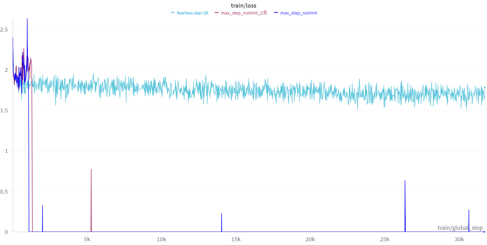

# KoAlpaca 에 대해 공부 - 3

[KoAlpaca 에 대해 공부 - 1](https://zayunsna.github.io/blog/2023-08-01-koalpaka/)

[KoAlpaca 에 대해 공부 - 2](https://zayunsna.github.io/blog/2023-08-08-koalpaka2/)

KoAlpaca - 2 에서 나열했던 의문점 1,2에 대해 계속해서 구글링을 진행했지만, 특별한 해결법을 발견하지 못했다.
정보를 모으고 공부하면서 정리된 현재 생각을 작성해보겠다.

### 의문점 1 - 갑작스러운 training loss의 drop

크게 2가지로 문제의 시작점을 정해볼 수 있다.

1. qlora 4bit의 성능 이슈
2. lora configuration의 문제

나열된 2개를 시작점으로 코드의 argument하나하나 조사하면서 공부하기 시작했다.
먼저 아래는 내가 KoAlpaca fine-tuning을 하면서 설정한 config다.

```python3
model_id = "beomi/polyglot-ko-12.8b-safetensors"
bnb_config = BitsAndBytesConfig(
	load_in_4bit = True,
	bnb_4bit_use_double_quany = True,
	bnb_4bit_quant_type = "nf4",
	bnb_4bit_compute_dtype = torch.bfloat16
)

lora_config = LoraConfig(
	r = 8,
	lora_alpha = 32,
	target_modules = ["query_key_value"],
	lora_dropout = 0.05,
	bias = "none",
	task_type = "CAUSAL_LM"
)
```

각 Argument에 대한 정의는 아래와 같다.

### BitsAndBytesConfig

1. `load_in_4bit`: 모델의 매개 변수를 4비트 정밀도 형식으로 불러올지 여부를 나타낸다. 4비트로 로딩하면 특히 메모리가 제한된 하드웨어에서 큰 모델을 배치하는 데 유용하게 메모리 사용량을 줄일 수 있다. 현재 내 상황에 딱 맞는 설정이다.
2. `bnb_4bit_use_double_quany`: 이 설정은 4비트 값에 대해 이중 양자화를 사용할지 여부를 나타낸다. 이중 양자화는 양자화된 값의 정확도를 향상시켜 저정밀 형식으로 모델의 성능을 개선할 수 있어서 4bit를 사용한다면 적용해야 할 옵션이다.
3. `bnb_4bit_quant_type`: 4비트 표현을 위한 양자화 유형을 지정. `nf4` 는 4-bit NormalFloat Quantization을 의미한다.
4. `bnb_4bit_compute_dtype`: 계산을 위한 데이터 유형을 설정한다. `torch.bfloat16`은 정밀도와 메모리 사용 사이의 균형을 제공하는 16비트 부동 소수점 형식이다. 효율적인 훈련 및 추론을 위해 딥러닝에서 자주 사용된다.

### LoraConfig

1. `r`: LoRA 기술에서의 저랭크 적응의 순위를 나타낸다. LoRA(저랭크 적응)는 소수의 훈련 가능한 매개 변수로 큰 사전 훈련된 모델을 적응시키는 방법. 순위가 높을수록 적응의 용량이 증가하지만 매개 변수의 수도 증가.
2. `lora_alpha`: LoRA 적응에 대한 scale-factor. 적응 과정에서 사용되는 저랭크 행렬의 크기를 제어한다.
3. `target_modules`: LoRA를 사용하여 적응시킬 신경망의 모듈(레이어나 attention blocks, 등)을 지정한다.`query_key_value`는 트랜스포머 모델의 특정 부분, 가능하게는 주의 메커니즘에서의 쿼리, 키 및 값 투영을 대상으로 하는 것을 나타낸다.
4. `lora_dropout`: LoRA로 적응된 모듈의 드롭아웃 비율.
5. `bias`: 적응 과정에서 바이어스를 다루는 방법을 제어한다. 여기서는 추가적인 바이어스를 사용하지 않는다.
6. `task_type`: 모델이 적응되는 작업 유형을 지정한다. "CAUSAL_LM"은 인과적 언어 모델링을 의미하는데, 이는 과거의 맥락에 따라 텍스트를 생성하는 언어 모델의 한 유형이다(과거와 미래의 맥락을 모두 고려하는 양방향 모델과 대비됨).

위 Configuration처럼 충분하고 쾌적한 학습환경이 아니기 때문에, 메모리 효율을 증가시키기 위해 4bit양자화를 채택해서 사용해왔다. 이 과정에서 예측할 수 없는 문제(Accidental Event)가 생겨 training loss drop이 발생한 것으로 추청 만 할 뿐이다.

이때 KoAlpaca - 2에 댓글을 달아주셨던 @limhasic님(감사합니다!)이 링크해준 gitbug issue에서 큰 힌트를 얻게 된다.

해당 링크는 타 qlora 유저가 나와 동일한 상황을 issue로 올렸고, 비슷한 현상을 겪었던 사람들과 논의가 이루어지고 있었다.

많은 유저들이 train loss drop에 대해 정확한 이유와 자료를 찾지 못해서 방황하던 중, 4-bit 양자화를 하고있던 나와는 조금 다르지믄 8-bit의 경우 `bitsandbytes`를 최신 버전으로 업데이트 하면 버그가 수정되 train loss drop이 나아질 수 있다는 답변이 올라왔다. 8-bit도 고쳐졌다는데 4-bit도 되겠지 싶어서 최후의 수단으로 업데이트를 진행했다. `pip install -U bitsandbytes`.

업데이트 후 dependency꼬인 부분이 없는 걸 확인, max_steps를 고려하지 않고 바로 3 epoch를 진행해 보았다.

그 결과...



위 train/loss graph에서 연한 하늘색 라인이 이번 결과다.

운이 좋아서 train loss drop이 안 일어난건지 몇 번 더 시도해 봐야겠지만 기존 2번의 3 epoch tuning에서 모두 초반에 train loss drop이 일어난 것을 생각하면 문제점이 해결된 것 같다.

우선은 drop없이 모든 tuning이 완료되었기 때문에 모델을 HuggingFace에 올려두었고, 테스트를 해보는 중이다.

Gradio를 사용해 간단한 ChatBot interface를 만들어서 모델을 테스트 중인데, Optimzation의 문제인지 모델을 이용해 답변을 생성할 때 최소 1분의 시간이 필요하다. (새로운 의문점 등장...)

결론적으로 성능은 좋지 않다. 그 이유는 의문점 2와도 연결되어있다.

### 의문점 2 - 성능 향상이 되지 않는 점

위 성공 화면에서 내가 '성공' 이라고 말한 이유는 train loss drop이 일어나지 않았다는 점 하나 뿐이다. 약 16시간정도의 tuninng시간동안 눈에 띄는 성능 향상은 일어나지 않았다.

조금 더 긴 Epoch로 진행해 보고 싶지었다. 내면속에서 "이는 training환경이 좋지 못해서 상대적으로 더 많은 epoch또는 training step이 필요해.." 라고 계속 생각이 나기 때문이다. 하지만 Epoch가 길어진다고 성능이 향상된다는 보장이 없어서 다른 관점으로 접근중이다..

역시나 4-bit 양자화로 생각이 돌아가게 된다. 성능 보정을 위해서 `bnb_4bit_use_double_quany` 옵션도 켜두었지만 솔직히 정확한 작동 원리와 영향을 제대로 모르고 있는 와중에 무조건적인 신뢰를 할 순 없다. 학습환경의 기계적인 한계를 이겨내고자 데이터를 쪼개서 학습하다 보니 제대로된 학습방향을 찾지 못한 가능성이 가장 크다고 생각이 된다.

그 효과를 몸소 체험해보기 위해 학습환경이 허락하는 정도까지 여러 다른 양자화를 사용해보고 있다.

이 결과는 돌아오는 KoAlpaca - 4에서 다뤄보도록 하겠다.
