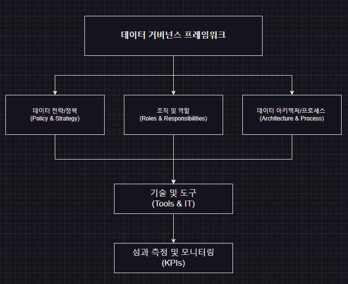

## 1. Key Components of a Data Governance Framework

A data governance framework is composed of multiple interconnected elements that together form the overall data management system. It typically includes:

- **Data Strategy & Policies**  
    Define the organization’s data utilization objectives, vision, and mission, and establish policies on data security, privacy, quality, and compliance.
    
- **Organization Structure & Roles**  
    Clarify the roles and responsibilities of data stakeholders—such as the Chief Data Officer (CDO), Data Steward, and Data Owner—to assign clear accountability for data management.
    
- **Data Architecture & Processes**  
    Design the end‑to‑end lifecycle of data—including ingestion, storage, integration, transformation (ETL), and analysis—mapping out each process step.
    
- **Technologies & Tools**  
    Build the technical infrastructure, including data repositories, ETL tools, metadata management systems, and data quality monitoring platforms.
    
- **Metrics & Monitoring**  
    Use KPIs, dashboards, and data quality indicators to assess the effectiveness of policies and processes and drive continuous improvement.
    
- **Training & Communication**  
    Establish education programs and internal communication channels so that all stakeholders understand and adhere to the framework and its policies.
    

---

## 2. How the Framework Operates

During the **Plan** phase, the data governance framework functions as follows:

1. **Set Objectives & Establish Policies**  
    Craft data management strategies and policies aligned with business goals—e.g., strengthening data security, improving quality, and enabling efficient data use.
    
2. **Assign Roles & Responsibilities**  
    Delegate data‑related duties to departments and individuals, and specify the corresponding authority and accountability.
    
3. **Define Processes**  
    Design detailed procedures for data collection, storage, processing, distribution, and disposal—incorporating validation and monitoring steps at each stage.

4. **Implement Technical Infrastructure**  
    Select and deploy IT systems (databases, ETL platforms, metadata tools, etc.) that support the defined policies and processes.
    
5. **Monitor Performance & Feedback**  
    Continuously evaluate data management outcomes against the established KPIs and dashboards, and refine policies or processes as needed.
    

By clarifying **what** will be managed, **who** is responsible, and **how** it will be done, the framework ensures that raw data is systematically cleansed, stored, and leveraged.

## 3. Considerations When Building the Framework

- **Alignment with Business Goals**  
    The data governance framework must be fully aligned with the organization’s overall business strategy.
    
- **Flexibility & Scalability**  
    Start with a core structure, then adapt it flexibly as data volumes and complexity grow.
    
- **Culture & Training**  
    Foster a culture in which team members understand and comply with policies and procedures through ongoing education.
    
- **Continuous Feedback**  
    Regularly monitor and review the framework to validate its effectiveness and drive iterative improvements.