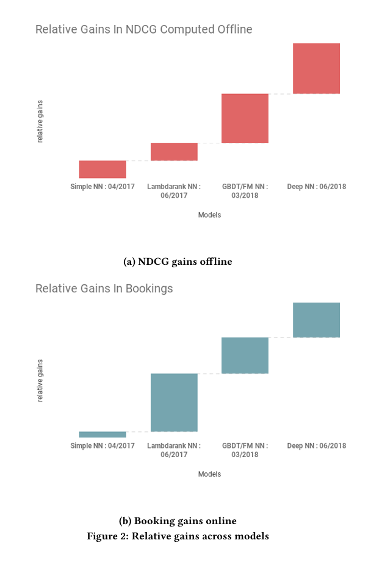
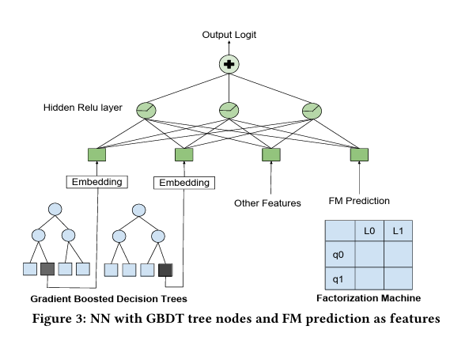
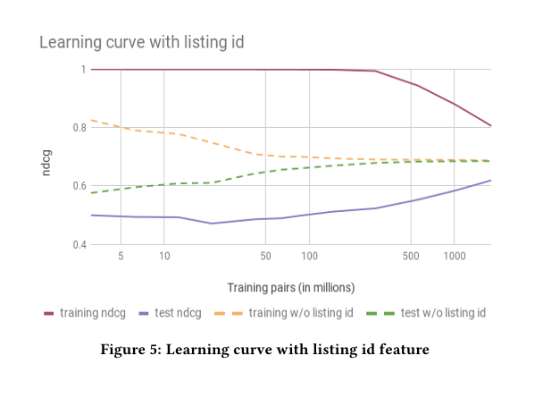
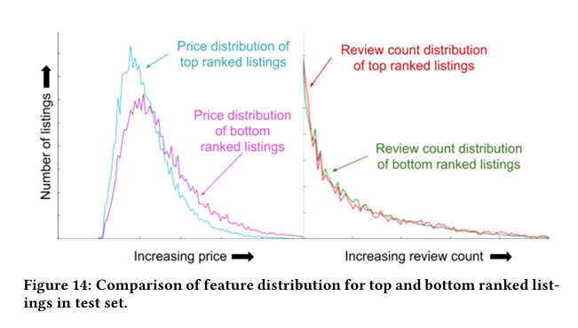

# Airbnb's Deep Learning Journey: Lessons from the Trenches

---
So I spent the weekend diving into how Airbnb tackled their search ranking problem, and honestly, it's fascinating how much trial and error went into it.

[HERE You can find the paper!](https://archive.is/o/j46tZ/https://arxiv.org/pdf/1810.09591)

You know how it goes when you're searching for a place on Airbnb—you type in "Miami" or whatever, and somehow their system decides which 20 places (out of thousands) to show you first. That ordering can make or break a host's business, and from a technical perspective, it's insanely complex.

For years, they were riding the Gradient Boosted Decision Tree (GBDT) wave like everyone else in the industry. It worked pretty well—until it didn't. Their team hit that dreaded performance plateau we all fear, where no amount of feature engineering or parameter tweaking would move the needle. Been there, done that.

### The Deep Learning Gamble
What I found most relatable was their first attempt at neural networks. 

Classic story—they built this straightforward NN implementation, hyped themselves up... and it barely matched their existing GBDT. 

Talk about deflating! But instead of scrapping the whole thing (which, let's be honest, is tempting when deadlines loom), they doubled down.
Their breakthrough came from an approach called "Lambdarank" which is essentially a smarter way of teaching the model what matters in rankings. 
I remember struggling with similar ranking problems at my last job—the issue isn't just predicting what users like, but actually getting the order right.

    

    <em>The evolution of Airbnb's ranking models, showing incremental gains with each approach. Note the significant jump with the final Deep NN that used 10x more training data.</em>

One detail that cracked me up was how they ended up combining three completely different models (Neural Networks, GBDT, and Factorization Machines) because they couldn't decide which one was best. It's such a realistic engineering compromise: "Well, all three approaches have merits... screw it, let's just use them all!"

    

    <em>The hybrid architecture that combined neural networks with GBDT tree nodes and Factorization Machine predictions—Airbnb's innovative but complex ensemble approach before simplifying.</em>

### The Data Revelation
Here's the kicker that changed my thinking: they eventually replaced their Frankenstein ensemble with a simpler neural network, but fed it 10x more data. And it demolished every previous model's performance.
God, how many times have we over-engineered solutions when we should've just been gathering more training data?

### The Failures (That They Actually Admitted)

    

    <em> Learning curves revealing the overfitting problem with listing IDs. Notice how models without listing IDs (green/orange) generalized better despite lower training performance.</em>

What I genuinely appreciated was their candor about approaches that flopped. They tried giving listings unique IDs to help the model "remember" properties—disaster. With sparse booking data, it just caused overfitting.
Their multi-task learning attempt was another interesting failure. The hypothesis made perfect sense: predict both views and bookings simultaneously since they're related. In practice? It increased views but didn't reliably convert to more bookings. Classic case of optimizing for the wrong metric.

### The Unglamorous But Critical Stuff
The parts that resonated most with me were the technical optimizations that nobody writes Medium articles about:

- They had to completely overhaul their data pipeline formats to speed up training
- Hyperparameter tuning was a massive headache (as always)
- Popular techniques like Dropout straight-up didn't help their models

And the interpretability challenges! When stakeholders asked "why is this listing ranked higher?", they couldn't just point to a decision tree node anymore. They had to develop entire parallel systems just to explain what the model was doing.

    

    <em> Price and review distributions between top and bottom-ranked listings. insights like these helped Airbnb understand what their 'black box' neural networks were actually prioritizing.</em>

### What I'm Taking Away
After spending way too much time thinking about this case study, here's my takeaway: successful ML in production isn't about implementing the sexiest new architecture from the latest paper. It's about:

1. **Starting simple and iterating constantly**
2. **Being willing to throw away approaches that aren't working**
3. **Recognizing when you need more data vs. more complexity**
4. **Making sure your infrastructure can actually support what you're building**

I'm curious if others have run into similar challenges with ranking systems or if you've found different approaches that worked better than what Airbnb did. Let me know your thoughts!