**"Histograms are one of the most fundamental tools in data science and statistics for visualizing how data is distributed."**

They appear in textbooks, research papers, and everyday analysis because they provide an immediate sense of where data points lie, how they cluster, and whether there are patterns like skewness or multiple peaks. 

In this post, we’ll explore histograms from the ground up, starting with their historical origins, and then dive into how to read them, how they differ from bar charts, their strengths and limitations, and some practical examples using Python. We’ll also discuss when to use histograms and what alternative visualizations (like KDE plots or box plots) can be useful for different needs. The goal is to provide a friendly yet comprehensive guide for beginners and a good refresher for seasoned professionals.

  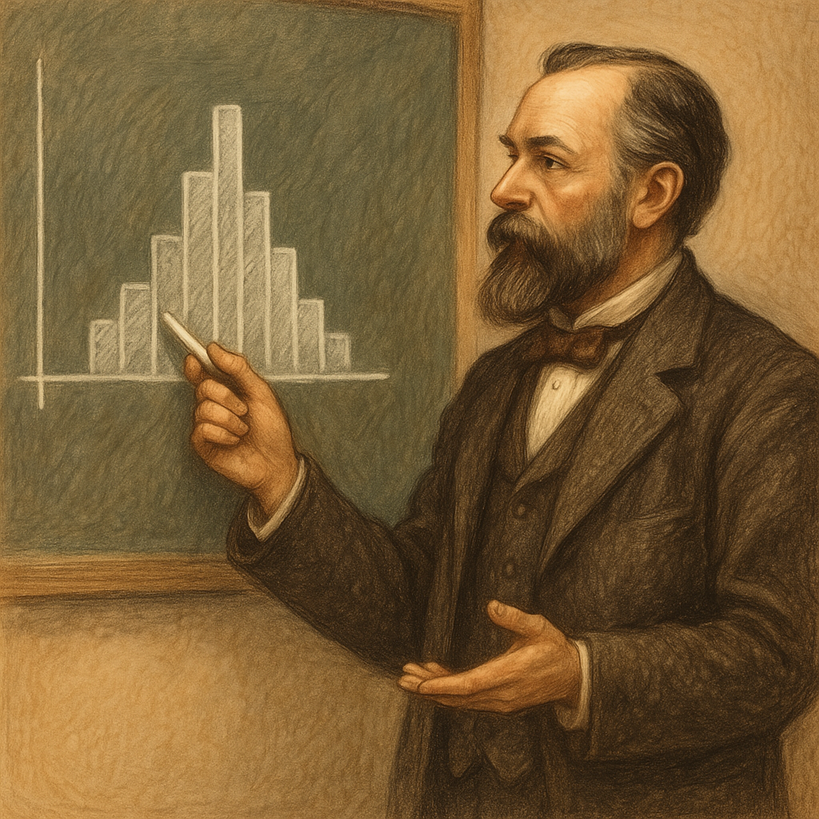

## A Brief History of Histograms
The concept of the histogram dates back to the late 19th century. It was introduced by the English statistician Karl Pearson around 1891.

    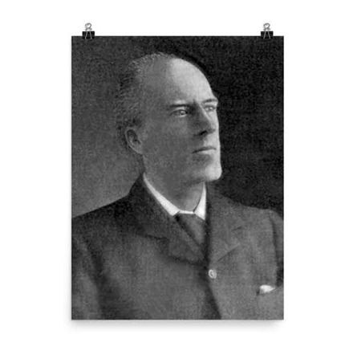

    <em> Karl Pearson (source: wiki) </em>

Pearson developed the histogram as a new kind of diagram to represent continuous data (as opposed to discrete categories). He even coined the term **"histogram"** to emphasize its use as a **“historical diagram”** for visualizing data over time. In one of his early lectures (November 1891), Pearson demonstrated histograms by charting historical time periods like the lengths of reigns of monarchs. 

Why was this needed? At the time, many statisticians were obsessed with the normal (bell-curve) distribution and tended to force-fit data into that mold. Pearson recognized that real data, whether biological measurements or economic figures, often did not follow a perfect normal curve. He sought better ways to visualize and analyze such data. 

The histogram was part of Pearson’s toolkit to display the actual distribution of data without assuming a specific theoretical shape. By grouping data into “bins” and plotting frequencies, Pearson’s histograms allowed scientists to see the empirical distribution, whether it was symmetric, skewed, or irregular, at a glance. This innovation was foundational in statistics: Pearson was “the first to systematically use” this form of data representation, and histograms have been commonplace ever since.

## How to Read and Understand a Histogram
A histogram is essentially a graphical representation of a dataset’s distribution. To construct one, we first divide the entire range of data values into a series of intervals (called bins), then count how many data points fall into each bin. Each bin is usually an equal-width range (though bins can be unequal if needed), and the bins are adjacent (contiguous) intervals covering the whole range without gaps. For each bin, we draw a bar whose height corresponds to the number of data points (the frequency) in that interval. The result is a bar chart that shows how the data are distributed across the value range.

  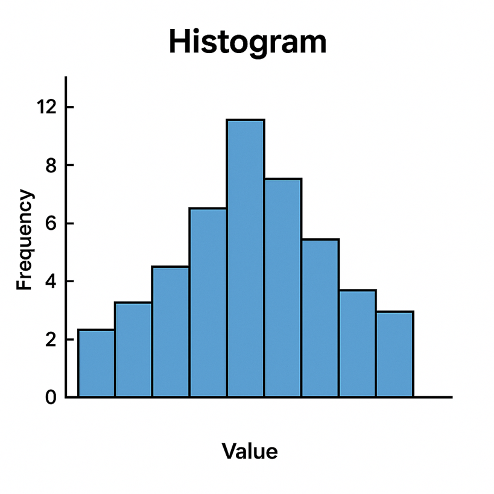

On the horizontal (x) axis of a histogram, you’ll typically find the data values (grouped into bins). The vertical (y) axis shows the frequency (count of observations) for each bin. By looking at the pattern of bars, you can quickly glean several important aspects of the data’s distribution 

|| **Overall Shape**: Is the histogram symmetric, skewed, or multi-modal? A symmetric (approximately “bell-shaped”) histogram has one central peak and looks roughly the same on the left and right sides. A skewed histogram has a longer tail on one side – for example, right-skewed means a peak on the left with a tail stretching rightward. A distribution can also be bimodal or multimodal, showing two or more peaks (indicating the data may come from two different groups or processes). There are also cases of a roughly uniform distribution, where bars are relatively even across the range (no clear peaks). The shape of the histogram is often the first thing to examine, as it reveals whether the data are normal, skewed, have outliers, etc.

|| **Central Tendency**: The center of the data can be observed by seeing where the histogram has its highest bar or concentration of bars. This often corresponds roughly to where the mean or median of the data lies. A tall central bar may indicate a common value or range around which many observations cluster . (Keep in mind, the exact mean/median isn’t directly labeled on a histogram, but the plot gives a visual estimate of where the “middle” of the data is.) 

|| **Spread (Variability)**: The width of the histogram – how far the distribution extends – indicates the variability of the data. A narrow, tall histogram (bars concentrated in a tight range) means low variability, whereas a wide histogram (bars spread out over a larger range) means high variability. You can roughly assess the range (min to max) from the histogram’s span, and see if the distribution is compact or very spread out.

|| **Outliers or Gaps**: Any isolated bars that are far apart from the others, or any visible gaps (empty bins) between bars, suggest there may be outliers or unusual clusters in the data . For example, if most data are between 50 and 100 but there’s a lone bar out around 200, that indicates an outlier value in that high range. Histograms make such anomalies stand out visually. 

  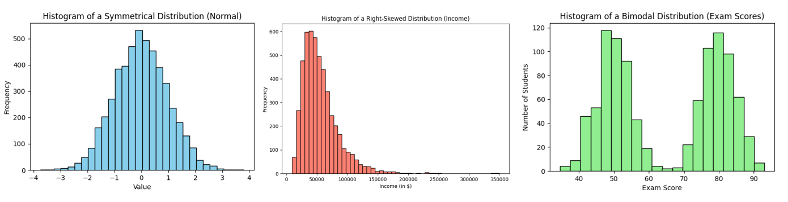

When reading a histogram, always pay attention to the bin size (width of intervals). Different bin widths can slightly change the appearance: too few bins might oversimplify the shape, while too many bins can introduce random noise or empty gaps. It’s often wise to experiment with bin sizes to ensure the histogram faithfully represents the underlying data pattern rather than artifacts of the binning. A good rule of thumb is to choose a bin width that neither over-smooths nor over-details the distribution – many tools will suggest a default, but using domain knowledge and a bit of trial-and-error helps.

Finally, note that the y-axis of a histogram can be scaled to show relative frequency (percentages) or a density instead of raw counts. For beginners, counts are most straightforward – the tallest bar means the most observations fell in that range. But in some cases (especially if comparing histograms with different sample sizes) using percentage on the y-axis is useful, or using density (where the area of bars sums to 1) for probability interpretations. Regardless of scaling, the shape remains the same; it’s the pattern of the bars that tells the story of the data.

## Histograms vs. Bar Charts
At first glance, a histogram looks a lot like a bar chart – both use bars to represent values. However, these two plot types serve different purposes and encode data in distinct ways: 

|| Data Type: A histogram displays the distribution of a quantitative (numeric) variable by grouping data into continuous intervals. In contrast, a classic bar chart compares categorical or discrete variables. For example, a bar chart might show the population of different countries, or the count of students in various class sections – each bar is a separate category. A histogram, on the other hand, might show the distribution of ages of those students by grouping ages into bins  (0-5, 5-10, 10-15, etc.).

|| Continuity and Order: Because histograms represent numeric intervals, their bars are contiguous – there are no gaps between the bars (unless a bin has zero frequency) . The bins follow a logical order (usually increasing numeric order). Bar charts, in contrast, typically have gaps between bars to indicate distinct categories, and the categories on the x-axis can be arranged arbitrarily (e.g. alphabetically or by size) since there’s no inherent numeric order . In a histogram, the x-axis is a number line; in a bar chart, the x-axis lists separate groups. 

|| Meaning of Bar Height: In both charts, bar height indicates a count or value. But in a bar chart it’s usually the value of that category (for instance, Sales Revenue  or Product A vs Product B). In a histogram, bar height is a frequency within a range of numeric values. All the bars together in a histogram illustrate one variable’s distribution, whereas each bar in a bar chart stands alone for a different item or group.

To make this concrete, consider an example: Suppose you have exam scores of students and you want to visualize them. A histogram of the scores might have bins like 0–10, 10–20, ..., 90–100, with bars showing how many students scored in each range. This would tell you the shape of the score distribution (perhaps showing a peak around 70–80, etc.). If you instead used a bar chart for the same data, you’d likely have a bar for each discrete score or each letter grade category – but a bar chart wouldn’t typically be used this way for so many values, as it would just replicate the table of scores. Bar charts would more appropriately show something like the average score in each class section (if you had multiple class groups), or the count of students in each letter grade category (A, B, C, ...). Those are separate categories, not continuous intervals.

  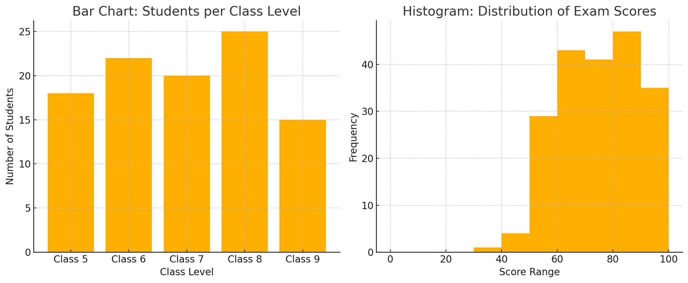

Side-by-side comparison of a bar chart (left) and a histogram (right). The bar chart (left) shows the number of girls in different class levels (Class 5 through Class 9), with gaps between the bars to indicate these are separate categories. The histogram (right) shows the distribution of exam scores in continuous intervals (bins) with no gaps between bars, since the data (scores) are numeric and continuous. 

In summary: Histograms group numeric data into bins and display frequencies, whereas bar charts compare categories. This distinction also leads to a visual difference – histogram bars touch each other (continuous bins) while bar chart bars are separated . Some authors even recommend always adding a small gap between bars in a bar chart to ensure no one confuses it with a histogram . If you remember that histograms = distributions of one  ariable, and bar charts = comparing different things, you’ll use each appropriately.

## Strengths and Limitations of Histograms
Like any visualization tool, histograms have their pros and cons. Understanding these will help you know when a histogram is the right choice for your analysis and when another plot might be more suitable. 

### Strengths (Advantages):

  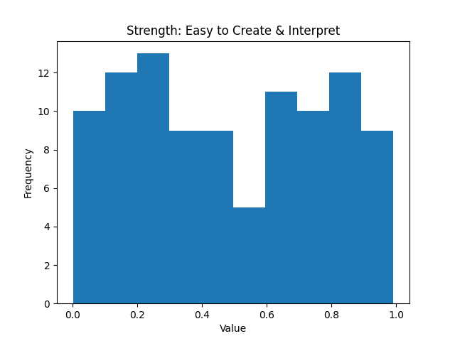

Easy to Create and Interpret: Histograms are simple to construct and widely understood. They’re essentially an extension of the familiar bar chart, so most people can read a histogram without much explanation. This simplicity makes them a user-friendly tool even for audiences with limited statistical background . With modern software, you can create a histogram with a single function call, making it a quick way to get a sense of your data.

  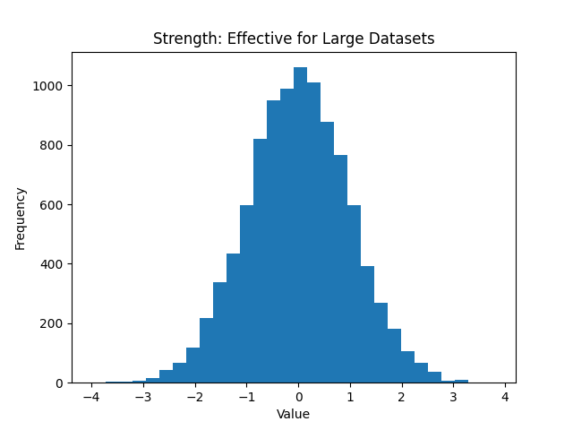

Effective for Large Datasets: Because they group data into bins, histograms can summarize large volumes of data into an easy-to-read visual form . Instead of looking at thousands of numbers, you see a plotted shape. This compression of information helps in identifying patterns – for example, you can immediately spot if thousands of data points form a normal-like curve or a skewed distribution. Histograms thus scale well to big datasets and reduce complexity by focusing on frequency trends.

  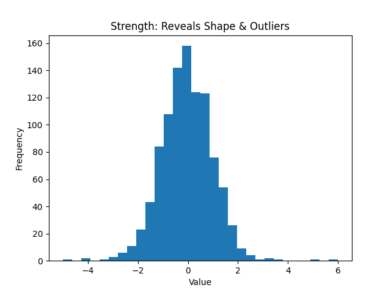

Reveals Distribution Shape and Outliers: A histogram provides a visual depiction of data distribution – you can quickly identify if the distribution is normal, skewed, uniform, or multimodal . It also highlights outliers or unusual concentrations of data. Patterns, trends, and any anomalies become apparent, aiding analysis and decision-making . In exploratory data analysis, the histogram is often one of the first plots used to check assumptions (like normality) and to guide further statistical modeling.

  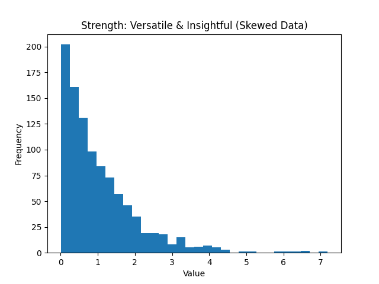

Versatile and Insightful: Histograms are useful in many fields – from quality control (they are one of the “seven basic tools of quality”) to academic research – whenever you need to understand how a variable behaves. They can handle data that aren’t nicely behaved (e.g., highly skewed data) and still give insight. By examining a histogram, you can gauge the data’s  entral tendency, variability, and skewness all at once . It’s a great way to get a feel for the data before diving into more complex analysis.

### Limitations (Disadvantages):

  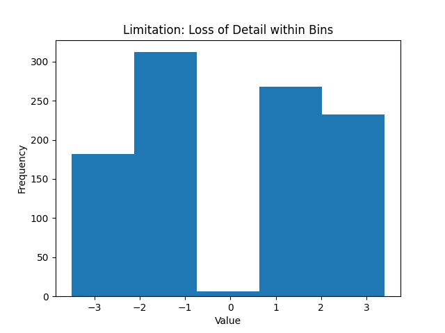

Loss of Detail and Individual Data: Histograms trade exactness for summary. Because data points are grouped into bins, you lose the individual data values – within a bin, a value of 15 and 19 are both just counted as “somewhere in 10–20” . This means you cannot retrieve precise information about specific points from a histogram; it provides a coarse-grained view. If you need to know each exact data point or preserve the raw data, a histogram isn’t the tool for that (a stemand-leaf plot or simply looking at the raw data would be necessary in that case). 

  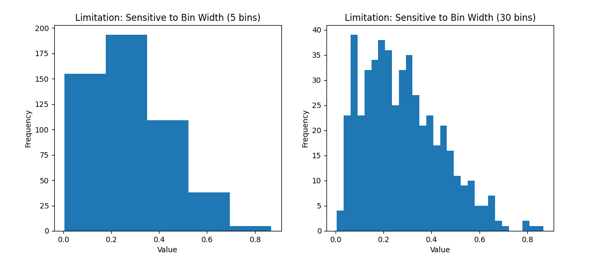

Dependence on Binning Choices: A histogram’s appearance can be quite sensitive to the choice of bin width (and the range covered). The number of bins (or their width) can significantly affect how the histogram looks and what story it tells . For example, using only 5 wide bins might smooth over important details (making the data look more uniform than it is), whereas using 50 narrow bins might produce a very noisy-looking histogram with lots of ups and downs. There is a subjective element here – one must choose binning that appropriately represents the data without misleading . Similarly, if the data range (min to max) is cropped or extended, it can change the visual (for instance, including a few extreme outliers can stretch the x-axis and make the bulk of the data appear squished in a narrow area). In short, histograms can sometimes be “manipulated” (even unintentionally) by binning decisions, so one should be cautious and perhaps try multiple bin settings .

  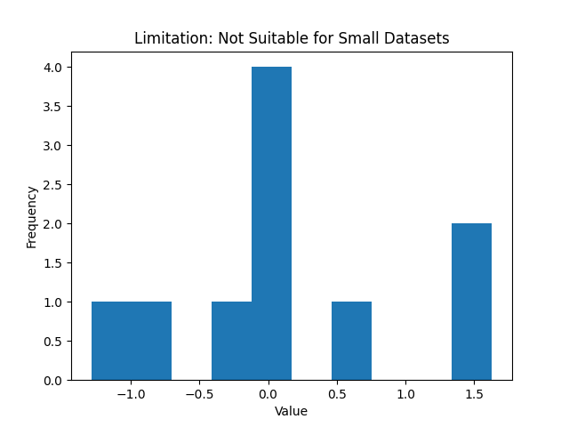

Not Great for Small Data Sets: If you have very few data points, a histogram might not be very informative . With, say, 5 or 10 observations, the histogram will have only a few bars (or many empty bins) and you might be better off just listing the values or using a different plot (like a dot plot or just the raw numbers). Histograms shine with moderate to large data sets where a smooth distribution shape emerges. For tiny datasets, the concept of a “distribution” is shaky, and other representations (like a stem-and-leaf plot, which preserves individual values) could be more appropriate.

  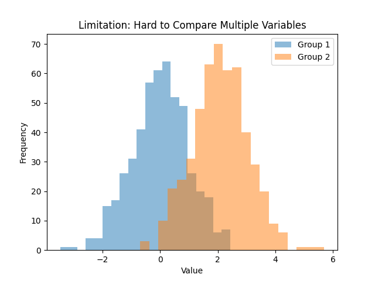

Cannot Show Multiple Variables Easily: A single histogram displays one variable’s distribution. If you want to compare distributions between groups, you often have to draw multiple histograms (either side by side or overlaid in some transparent fashion). Comparing multiple histograms can be tricky and cluttered, especially if the distributions overlap. For example, comparing the income distributions of two cities would require two histograms – one for each city – and interpreting differences might not be straightforward if plotted together. This makes histograms less flexible when you need to visualize and compare more than one dataset on the same chart . Other plots (like overlapping density plots or side-by-side box plots) are usually better for comparison tasks.

  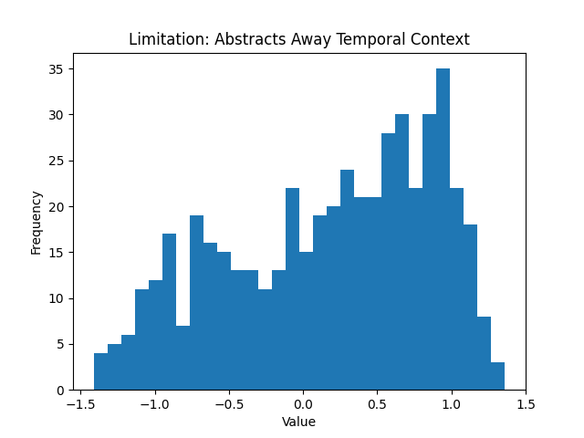

Abstracts Away Temporal or Contextual Information: This is a more subtle limitation – by collapsing data into a frequency distribution, histograms ignore any time order or sequence the data may have had. If the data were collected over time and had trends or cycles (say, daily sales over a year), a histogram of all sales would hide any seasonal pattern because it just aggregates all values together . In quality control or experimental contexts, if you combine data from different batches or conditions, a single histogram won’t tell you if one batch was different from another over time. Thus, while histograms are great static snapshots of distribution, they don’t replace time-series plots or other methods when sequence matters.

Despite these limitations, histograms remain an indispensable tool. The key is to use them appropriately – understand what they show and what they don’t. Next, let’s cement our understanding by looking at a few examples of histograms in action, using Python to generate some typical distributions.

## When to Use Histograms and Alternatives
Histograms are incredibly useful, but knowing when to use them (and when not to) is just as important.
Here are some guidelines:

### Use a Histogram when:

You want to understand the distribution of a single quantitative variable. Histograms are a go to choice for exploratory data analysis of one variable at a time. They excel at showing you the shape of the data – whether it’s normal, skewed, has outliers, etc. . If you find yourself asking “what does the distribution look like?”, a histogram is likely the answer.

You have a moderate to large dataset. Because histograms rely on grouping data into bins, they work best when you have enough data to form a meaningful distribution. With a large dataset, a histogram can reveal fine details of the distribution and any anomalies. (With tiny datasets, as mentioned, a histogram might be less informative).

You need to communicate distribution insights to others. Histograms are intuitive for general audiences. If you need to present findings – say, showing the distribution of response times in an app or the spread of test scores – a histogram conveys the message in a straightforward, visual way . Non-technical stakeholders can grasp concepts like “most values fall in this range” or “there’s a long tail to the right” from a histogram more easily than from raw numbers or tables.

Identifying outliers or data issues is important. A histogram can quickly flag if something is off. For example, if data were entered in the wrong units for some entries, you might see an odd separate bar far from the rest of the data. In quality control contexts, histograms are useful for seeing if a process is centered and within bounds or if there are strange deviations.

However, histograms are not always the best choice. Depending on what you want to achieve, you might consider other visualization tools:

  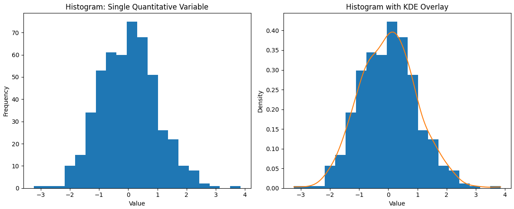

Density Plots (KDE plots): A kernel density estimate (KDE) plot is essentially a smooth version of a histogram. It uses a kernel smoothing technique to create a continuous curve that represents the distribution of the data . Unlike a histogram, which can look blocky or vary with bin width, a density plot is not dependent on bins – it produces a fluid curve where the peaks correspond to where data are concentrated. KDE plots are great for overlaying multiple distributions (you can draw several smooth curves on the same axes with different colors) to compare them . They also can reveal multi-modality clearly with multiple bumps in the curve. The trade-off is that a density plot is a smoothed approximation – it might show a peak where there isn’t an exact bin, or smooth over a sharp drop – but with a good choice of bandwidth (smoothing parameter), it provides an elegant view of the underlying distribution shape. In practice, many data scientists use histograms and KDE plots together (often plotting a KDE curve on top of a histogram) for a complementary view. The histogram shows the actual counts, while the KDE highlights the general shape without the choppiness of bins.

  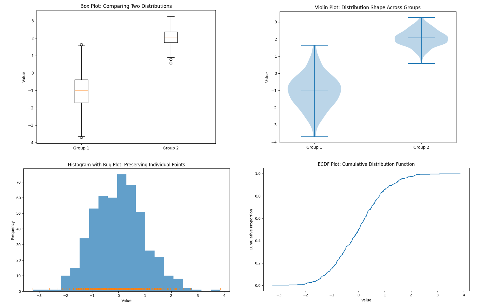

Box Plots: If you need to compare distributions across multiple groups, box plots are extremely useful. A box plot (or box-and-whisker plot) summarizes a distribution with just a few statistics – median, quartiles, and any outliers – shown in a compact graphical form. For example, you could use side-by-side box plots to compare exam score distributions for different classes, or income distributions for different regions, all in one chart. It’s very easy to compare medians and spreads at a glance using box plots . The strength of box plots is that they are compact and great for comparisons. They let you put many groups on one plot without clutter. However, they hide the detailed shape of the distribution . You won’t see if a distribution is bimodal from a box plot, for instance – two very different shaped distributions could produce the same exact box plot if their quartiles are similar . So, box plots trade detail for simplicity. Use them when the median and variability (and outliers) are of primary interest, especially in comparing across categories. They’re often a better choice than multiple histograms when comparing several datasets because they organize the information more cleanly.

Violin Plots: A violin plot is like a hybrid of a box plot and a density plot. It shows a density estimate of the distribution (like a KDE, mirrored on both sides to look like a violin shape), along with markers for median and quartiles. Violin plots can be used in similar situations as box plots (comparisons across groups) but give more insight into the distribution’s shape (e.g., if it’s bimodal, the violin will look pinched in the middle with two bulges). They are a bit less common in basic usage, but very powerful for multi-distribution comparisons. Stem-and-Leaf Plots or Rug Plots: If you have a smaller dataset and want to preserve individual values, a stem-and-leaf plot can be a neat option (it’s like a histogram on its side that lists the actual values). It’s a bit old-fashioned and typically taught in introductory stats – basically, it shows the distribution while still displaying each data point. A rug plot is a simpler visual: it’s just tick marks on an axis for each data point (often shown underneath a histogram or density plot to indicate where individual points are). These aren’t common in reports but useful in exploratory analysis.

Empirical Cumulative Distribution Function (ECDF) plots: An ECDF plot shows the cumulative proportion of data up to each value. It’s another way to display distribution information and has the advantage of plotting every individual point in a cumulative way. They can be useful for seeing median (at 50%) and comparing distributions too, though they require a bit more explanation to a lay audience. In practice, if your goal is to understand and communicate the distribution of a dataset, you might start with a histogram (quick and easy), then perhaps overlay or switch to a density plot for a smoother view, and use box plots for comparisons. Each tool has its place. The histogram remains a foundational method – it’s often the first thing we reach for when confronted with a new batch of data, and for good reason. It provides a visceral, visual sense of “what’s going on” with the data.

## Conclusion..!
In summary, histograms are powerful for revealing the shape of data distributions, easy to interpret, and broadly useful in statistical analysis. They come from a rich history (thanks to Karl Pearson) and have stood the test of time. By understanding how to read them and being aware of their limitations, you can leverage histograms to gain insights into your data and communicate those insights effectively. Whether you’re an undergraduate student just learning statistics or a seasoned analyst reviewing data distributions, the humble histogram is a friend you’ll return to again and again – offering a window into the underlying patterns that numbers alone might not reveal. Happy histogramming!